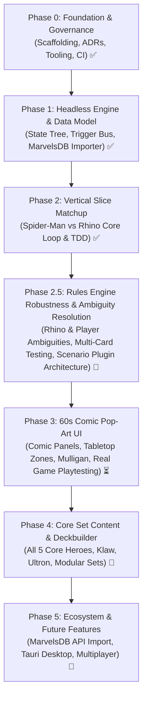

# Marvel Champions Digital (MCD) — Roadmap & Milestones

This document outlines the phased development roadmap for **Marvel Champions Digital**. It follows an iterative, **Vertical Slice** approach, ensuring the pure rules engine is proven out and tested before layering on visual polish and extended card sets.

---

## 🎯 Feature Prioritization Framework

All uncompleted and future roadmap items are categorized using the following priority scale:

| Level | Badge | Description | Target |
| :--- | :--- | :--- | :--- |
| **P0** | `🔴 [Must-Have]` | **Critical Path / Core Playability:** Non-negotiable for a fully functional, playable game loop. | Immediate (Current Sprint) |
| **P1** | `🟠 [Should-Have]` | **High Priority / Core Content:** Essential UX, complete Core Set cards, and key accessibility features. | Phase 3 & Phase 4 |
| **P2** | `🟡 [Nice-to-Have]` | **Polish & Ergonomics:** Visual flourishes, audio, mobile layout adaptations, and developer tooling. | Phase 4 & Phase 5 |
| **P3** | `🔵 [Future / Experimental]` | **Ecosystem & Distribution:** Native desktop binaries, multiplayer, and multi-language packs. | Phase 5+ |

---

## 🗺️ Roadmap Overview

---

## 📍 Phase 0: Project Inception & Foundation ✅ (Completed)
* [x] **Architecture Decision Records (ADRs):** ADR-0001 through ADR-0005 created and indexed.
* [x] **Technology Selection:** TypeScript + React + Tailwind + Vitest + Tauri.
* [x] **Open-Source Governance:** MIT License, README, CONTRIBUTING, CODE_OF_CONDUCT, SECURITY, and CI workflow.
* [x] **Tooling & Scaffolding:** Vite 5, TypeScript 5, Vitest, Tailwind with Comic Theme, smoke tests verified.

---

## 📍 Phase 1: Headless Rules Engine & Data Modeling ✅ (Completed)
*Objective: Build the 100% headless, deterministic game rules machine with full TDD coverage.*

### Milestones Completed
1. [x] **Card Data Models & MarvelsDB Ingestion:**
   * Ingest and map core card types from `marvelsdb-json-data` (Identity, Hero, Alter-Ego, Ally, Event, Resource, Upgrade, Support, Villain, Main Scheme, Side Scheme, Minion, Attachment, Treachery, Obligation).
   * Define type-safe Card schemas with traits, stats, resource icons, and effect hooks.
2. [x] **Deterministic Game State Tree:**
   * Immutable `GameState` representation (Player state, Hero/Alter-Ego form, Hand, Deck, Discard, Tableau, Villain HP, Main Scheme Threat, Acceleration tokens, Boost piles).
   * State serialization and deserialization (JSON save/load ready).
3. [x] **Action Pipeline & Trigger Resolution Machine:**
   * Phase Loop: Player Phase $\leftrightarrow$ Villain Phase.
   * Action Queue with nested trigger hierarchy:
     * `Pre-check (Legality)` $\rightarrow$ `Cost Payment (Discard / Generator)` $\rightarrow$ `Forced Interrupts` $\rightarrow$ `Interrupts` $\rightarrow$ `Resolution` $\rightarrow$ `Replacement Effects (Tough)` $\rightarrow$ `Forced Responses` $\rightarrow$ `Responses`.
   * Status Effect System (*Tough, Stunned, Confused*).
   * Board Restrictions (*Guard, Patrol, Crisis, Hazard, Amplify*).
4. [x] **Villain Phase Automation:**
   * Step 1: Main scheme threat placement.
   * Step 2: Villain activations (Attack vs Hero, Scheme vs Alter-Ego) with boost card draws and boost icons/star triggers.
   * Step 3: Minion activations against engaged heroes.
   * Step 4: Deal encounter cards.
   * Step 5: Reveal and resolve encounter cards in player order.
   * Step 6: Pass first player token.

---

## 📍 Phase 2: First Playable Matchup (Vertical Slice) ✅ (Completed)
*Objective: Deliver a 100% automated, fully working game simulation of the Core Set introductory matchup.*

### Matchup: Spider-Man (Justice) vs. Rhino (Standard I + Bomb Scare)
* [x] **Hero Identity:** Peter Parker / Spider-Man (Spider-Sense, Web-Shooter, Backflip, Swinging Web Kick, Spider-Tracer, Aunt May).
* [x] **Aspect:** Justice cards (For Justice!, Great Responsibility, Interrogation Room, Jessica Jones, Surveillance Team).
* [x] **Basic Cards:** Genius, Energy, Strength, Haymaker, Emergency, First Aid.
* [x] **Villain:** Rhino I & Rhino II + *The Break-In!* Main Scheme.
* [x] **Modular Set:** Bomb Scare (Hydra Soldier, False Alarm, Bomb Scare Side Scheme).
* [x] **Official Setup Pipeline (Steps 1–11):** Automatic obligation deck shuffle and 5-card Nemesis set isolation.
* [x] **Automated Scenario Tests:** 56 unit tests validating every card interaction, win condition (Rhino II defeated), and lose conditions (Threat reaches target or Hero HP reaches 0).

---

## 📍 Phase 2.5: Rules Engine Robustness, Ambiguity Resolution & Scenario Plugins 🚧 (Current Sprint / Critical Path)
*Objective: Fix all engine ambiguities and build a modular scenario plugin architecture BEFORE proceeding to live game testing.*

### 1. 🔴 `[Must-Have]` Rhino Encounter Set Ambiguity Resolution (`docs/ambiguities/core_encounter_*.md`)
* [ ] **Multi-Stage Villain Transition State Machine (Tier 3 Gate):**
  * Implement automatic villain progression upon reaching 0 HP: Stage I $\rightarrow$ Stage II (`01095`) $\rightarrow$ Stage III (`01096`).
  * Reset HP to `healthPerPlayer * players.length`, apply initial status/tokens (*Tough* on Stage III), and fire `WHEN_REVEALED` stage effects.
* [ ] **Fully Qualified Game Zone Search & Shuffle Primitive:**
  * Implement `SEARCH_AND_REVEAL_SIDE_SCHEME` to search across `["ENCOUNTER_DECK", "ENCOUNTER_DISCARD"]` for *Breakin' & Takin'* (`01107`), reveal it, and execute `shuffleDeck: "ENCOUNTER_DECK"`.
* [ ] **Attachment Combat & Damage Absorption Pipeline:**
  * Intercept incoming damage to villain with attachment armor counters (*Armored Rhino Suit* `01098`).
  * Scan attachments during Step 2 activations to apply +3 ATK and *Overkill* (*Charge* `01099`) and +1 SCH (*Enhanced Ivory Horn* `01100`).
* [ ] **Step 5 Reveal Trigger Dispatch for Minions & Side Schemes:**
  * Wire declarative `WHEN_REVEALED` execution in `villain-phase.ts:step5` for *Shocker* (`01103`), *Hydra Bomber* (`01110`), *Bomb Scare* (`01109`), and *Breakin' & Takin'* (`01107`).
* [ ] **Nemesis Search & Spawn Pipeline:**
  * Implement *Shadow of the Past* (`01190`): search `SET_ASIDE_NEMESIS`, put Nemesis Minion and Side Scheme into play, and shuffle remaining Nemesis cards into `ENCOUNTER_DECK`.

### 2. 🔴 `[Must-Have]` Core Player Cards Ambiguity Resolution (`docs/ambiguities/core_*.md`)
* [ ] **Hero Signature Upgrade Subsystems:**
  * *Iron Man* (`01029a`/`01029b`): Dynamic hand-size scaling from in-play *Tech* upgrades.
  * *Black Panther* (`01040a`-`01049`): *Wakanda Forever!* execution pipeline triggering in-play *Special* upgrades in player-selected order.
  * *Captain Marvel* (`01010a`-`01018`): Energy counter accumulation on *Energy Channel* and *Cosmic Flight*.
  * *She-Hulk* (`01019a`-`01028`): Form change reaction (*Do You Even Lift?*) and *Gamma Slam* scaling from damage tokens.
* [ ] **Context-Aware Aspect Resources:**
  * Evaluate card aspect in `legality-checker.ts` to grant double resources for *The Power of Aggression* (`01055`), *The Power of Justice* (`01062`), *The Power of Leadership* (`01072`), and *The Power of Protection* (`01079`).
* [ ] **Constant Stat Buff Modifiers:**
  * Dynamically calculate hero/ally ATK, THW, and DEF including attached upgrades (*Combat Training* `01057`, *Heroic Intuition* `01065`, *Armored Vest* `01081`, *Inspired* `01074`).
* [ ] **Discard & Deck Search/Play Primitives:**
  * Implement *Make the Call* (`01071`), *Ancestral Knowledge* (`01042`), and *Shuri* (`01041`).
* [ ] **Interactive Decision Prompt Modal State Machine (ADR-0020):**
  * `pendingDecisionPrompt` on `GameState` for optional interrupts (*Emergency* `01085`, *Great Responsibility* `01061`) and multi-choice resolution (*Nick Fury* `01084` choose 1 of 3).

### 3. 🔴 `[Must-Have]` Modular Scenario Plugin Architecture (`ScenarioPlugin`)
* [ ] **Core `ScenarioPlugin` Interface:**
  * Decouple scenario-specific setup and special rules from core pipeline files (`villain-phase.ts`, `action-dispatcher.ts`).
  * Define lifecycle hooks: `onGameSetup`, `onVillainPhaseStep1`, `onStageAdvance`, `onMainSchemeComplete`, `evaluateWinLossConditions`.
* [ ] **`RhinoScenarioPlugin`:**
  * Encapsulate *The Break-In!* setup, 0-to-7 threat scaling, Stage I $\rightarrow$ II $\rightarrow$ III progression rules, and *Breakin' & Takin'* spawn logic.
* [ ] **Scenario Plugin Registry:**
  * Dynamic scenario resolver enabling seamless addition of future scenarios (Klaw, Ultron, Mutagen Formula) without modifying core rules engine code.

### 4. 🔴 `[Must-Have]` Extensive Multi-Card Interaction Test Matrix
* [ ] Dedicated test suites in `tests/engine/` verifying:
  * Multi-stage villain transitions with stage When Revealed triggers.
  * Reaction windows, interrupt prompts (Accept vs Decline), and defense timing.
  * Multi-card combat modifiers (+ATK, Overkill, Damage Absorption).
  * 100% Inbox Zero verification across `docs/ambiguities/`.

---

## 📍 Phase 3: 60s Comic Pop-Art Presentation Layer ⏳ (In Progress)
*Objective: Build the dynamic, comic-styled visual interface and live playtesting flows.*

* [x] **Comic Tabletop Layout (ADR-0004):**
  * Top Panel: Scenario & Villain Zone (Encounter Piles $\rightarrow$ Villain & HP $\rightarrow$ Main Scheme Threat Meter $\rightarrow$ Side Schemes).
  * Center Panel: Hero Zone (Engaged Minions banner $\rightarrow$ Hero Identity & HP $\rightarrow$ Allies $\rightarrow$ Tableau Upgrades/Supports).
  * Sticky Bottom Dock: Player Hand Tray (Player Deck/Discard $\rightarrow$ Fanned Hand $\rightarrow$ Out-of-Play Nemesis Minion).
* [x] **Boundary-Aware Hover-Zoom (ADR-0012):**
  * Real-time $1.9\times$ magnification respecting 4-way viewport boundaries with unconstrained Z-axis elevation (`z-50`).
* [x] **Pre-Game Flows:**
  * Scenario Selector (Solo 1–4 Hero scaling, Standard/Expert difficulty).
  * Interactive Multi-Hero Mulligan Screen.
* [x] **Developer Mode & Deck Inspectors (ADR-0013):**
  * Persistent `GameSettingsContext` with top bar Dev Mode indicator and Options Menu.
  * Encounter Deck Inspector with multi-tier sorting (Deck Order, Card Type, Encounter Set).
  * Player Deck Inspector with multi-tier sorting (Deck Order, Card Type, Affinity, Cost with direction toggle and separated Resource cards).
* [x] 🔴 `[Must-Have]` **Multi-Handed Solo UI Layout & Second Core Hero Deck (Captain Marvel - Leadership):**
  * Built-in multi-hero architectural baseline in engine and UI supporting 1 to 4 heroes natively.
  * Addition of second prebuilt Core Set starter deck: **Captain Marvel (Leadership)** (Carol Danvers / Captain Marvel, 15 signature cards, Leadership aspect cards like *Make the Call*, *Maria Hill*, *Lead from the Front*, *Family Emergency* obligation, and *Yon-Rogg* 5-card nemesis set).
  * Multi-Hero Setup & Mulligan screen with Starting Player token indicator (RR v1.8 Step 12).
* [x] 🔴 `[Must-Have]` **Panoramic Horizontal Tabletop & Edge Scrolling (ADR-0017):**
  * Continuous horizontal tabletop canvas for 1–4 players with full-size 880px stations, single-row card hands, unconstrained $1.9\times$ hover-zoom, and full-screen portal modals.
  * Real-time velocity-based edge-hover auto-panning (`useEdgeScroll`), drag-to-scroll readiness, and quick-jump compass navigation.
  * User-adjustable Edge-Scroll Velocity controls (Slow, Normal Default, Fast).
* [ ] 🔴 `[Must-Have]` **Interactive Card Play & Resource Payment Modal:**
  * Clicking a card in hand opens the payment modal with resource selection from hand cards and exhausted generators (*Web-Shooter*, Peter Parker's Scientist ability, Carol Danvers' Rechannel).
* [ ] 🔴 `[Must-Have]` **Hero Identity Basic Actions:**
  * Interactive action buttons on Hero station: Suit Up / Flip form, Basic Attack, Basic Thwart, Basic Recover.
* [ ] 🔴 `[Must-Have]` **Turn Pass & Step-by-Step Villain Phase Execution:**
  * Pass turn button triggering sequential Villain Phase activations and upkeep card redraws in player order.
* [ ] 🔴 `[Must-Have]` **Win / Defeat Victory Banners:**
  * Game-over modal overlay when Villain is defeated (Victory) or Hero HP reaches 0 / Scheme target reached (Defeat).
* [ ] 🟠 `[Should-Have]` **Dynamic Onomatopoeia Overlays:**
  * Starburst spring-physics popups (*POW!*, *BAM!*, *KAPOW!*, *THWIP!*, *FOILED!*, *CLANG!*).
* [ ] 🟡 `[Nice-to-Have]` **Audio & Sound Effects:**
  * Retro comic action sounds, card dealing chimes, and punch impacts.

---

## 📍 Phase 4: Core Set Expansion & Deckbuilder 🃏 (Planned)
*Objective: Complete all Core Set content and local deck management.*

* 🔴 `[Must-Have]` **Remaining 3 Core Set Heroes:**
  * Iron Man (Aggression), She-Hulk (Aggression), Black Panther (Protection).
* 🔴 `[Must-Have]` **Remaining 2 Core Set Villains:**
  * Klaw (Stage I & II + Weapons Runner / Boost cards), Ultron (Stage I & II + Drone mechanics).
* 🟠 `[Should-Have]` **Core Modular Encounter Sets:**
  * Masters of Evil, Under Attack, Legions of Hydra, The Doomsday Chair.
* 🟠 `[Should-Have]` **In-Game Custom Deckbuilder:**
  * Filter cards by aspect, resource, trait; create, validate deck legality (40–50 cards), and save custom decks to `localStorage`.
* 🟡 `[Nice-to-Have]` **Custom Scenario Builder:**
  * Combine any villain with any modular encounter set and difficulty level.

---

## 📍 Phase 5: Ecosystem, Desktop Packaging & Future Features 🚀 (Planned)
*Objective: Community connectivity, cross-device experience, and native distribution.*

* 🟠 `[Should-Have]` **Power-User Keyboard Shortcuts & Hotkeys:**
  * Configurable hotkeys for rapid play and accessibility (`Space`, `F`, `A`, `T`, `R`, `1`–`9`, `L`, `Esc`).
* 🟠 `[Should-Have]` **MarvelsDB Public REST API Integration:**
  * 1-click **"Import Deck by MarvelsDB URL / ID"** button to load any community deck directly from `https://marvelcdb.com`.
* 🟡 `[Nice-to-Have]` **Adaptive Device & Viewport Orientation:**
  * Fully responsive board layout dynamically adapting between **Portrait** (vertical column stack optimized for mobile phones/tablets) and **Landscape** (horizontal 2-tier tabletop for desktop and widescreen displays).
* 🟡 `[Nice-to-Have]` **Touch & Mobile/Tablet Compatibility:**
  * Touch-optimized gestures: tap-to-inspect, swipe-to-scroll hand dock, long-press preview zoom, and enlarged touch targets for tablet/mobile web and Tauri mobile apps.
* 🟡 `[Nice-to-Have]` **Developer State Presets (Debug Playground):**
  * Quick-switcher dropdown in Dev Mode offering pre-configured scenario states (e.g., *"Mid-game: 3 Engaged Minions"*, *"Main Scheme at 90% Threat"*, *"Villain Stage II with 3 Attachments"*) for instant edge-case testing and UI layout validation.
* 🔵 `[Future / Experimental]` **Native Desktop Executable (Tauri):**
  * Package standalone Windows `.exe` and installers with native file system access and ultra-low RAM footprint.
* 🔵 `[Future / Experimental]` **Localization Packs:**
  * Complete translations for French, Spanish, German, etc. via `i18next` and MarvelsDB multi-lingual sets.
* 🔵 `[Future / Experimental]` **Peer-to-Peer Network Multiplayer:**
  * Synchronized game state room for 2–4 players over WebRTC / WebSockets.
