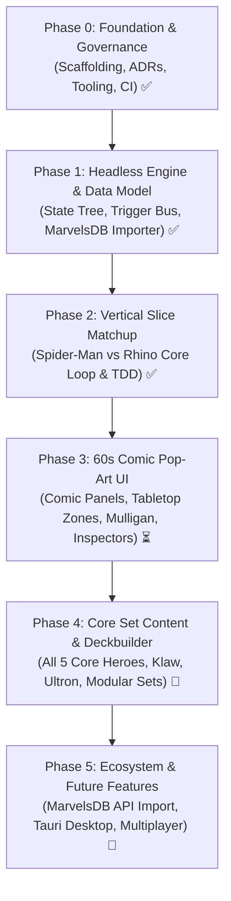

# Marvel Champions Digital (MCD) — Roadmap & Milestones

This document outlines the phased development roadmap for **Marvel Champions Digital**. It follows an iterative, **Vertical Slice** approach, ensuring the pure rules engine is proven out and tested before layering on visual polish and extended card sets.

---

## 🗺️ Roadmap Overview

---

## 📍 Phase 0: Project Inception & Foundation ✅ (Completed)
* [x] **Architecture Decision Records (ADRs):** ADR-0001 through ADR-0005 created and indexed.
* [x] **Technology Selection:** TypeScript + React + Tailwind + Vitest + Tauri.
* [x] **Open-Source Governance:** MIT License, README, CONTRIBUTING, CODE_OF_CONDUCT, SECURITY, and CI workflow.
* [x] **Tooling & Scaffolding:** Vite 5, TypeScript 5, Vitest, Tailwind with Comic Theme, smoke tests verified.

---

## 📍 Phase 1: Headless Rules Engine & Data Modeling ✅ (Completed)
*Objective: Build the 100% headless, deterministic game rules machine with full TDD coverage.*

### Milestones Completed
1. [x] **Card Data Models & MarvelsDB Ingestion:**
   * Ingest and map core card types from `marvelsdb-json-data` (Identity, Hero, Alter-Ego, Ally, Event, Resource, Upgrade, Support, Villain, Main Scheme, Side Scheme, Minion, Attachment, Treachery, Obligation).
   * Define type-safe Card schemas with traits, stats, resource icons, and effect hooks.
2. [x] **Deterministic Game State Tree:**
   * Immutable `GameState` representation (Player state, Hero/Alter-Ego form, Hand, Deck, Discard, Tableau, Villain HP, Main Scheme Threat, Acceleration tokens, Boost piles).
   * State serialization and deserialization (JSON save/load ready).
3. [x] **Action Pipeline & Trigger Resolution Machine:**
   * Phase Loop: Player Phase $\leftrightarrow$ Villain Phase.
   * Action Queue with nested trigger hierarchy:
     * `Pre-check (Legality)` $\rightarrow$ `Cost Payment (Discard / Generator)` $\rightarrow$ `Forced Interrupts` $\rightarrow$ `Interrupts` $\rightarrow$ `Resolution` $\rightarrow$ `Replacement Effects (Tough)` $\rightarrow$ `Forced Responses` $\rightarrow$ `Responses`.
   * Status Effect System (*Tough, Stunned, Confused*).
   * Board Restrictions (*Guard, Patrol, Crisis, Hazard, Amplify*).
4. [x] **Villain Phase Automation:**
   * Step 1: Main scheme threat placement.
   * Step 2: Villain activations (Attack vs Hero, Scheme vs Alter-Ego) with boost card draws and boost icons/star triggers.
   * Step 3: Minion activations against engaged heroes.
   * Step 4: Deal encounter cards.
   * Step 5: Reveal and resolve encounter cards in player order.
   * Step 6: Pass first player token.

---

## 📍 Phase 2: First Playable Matchup (Vertical Slice) ✅ (Completed)
*Objective: Deliver a 100% automated, fully working game simulation of the Core Set introductory matchup.*

### Matchup: Spider-Man (Justice) vs. Rhino (Standard I + Bomb Scare)
* [x] **Hero Identity:** Peter Parker / Spider-Man (Spider-Sense, Web-Shooter, Backflip, Swinging Web Kick, Spider-Tracer, Aunt May).
* [x] **Aspect:** Justice cards (For Justice!, Great Responsibility, Interrogation Room, Jessica Jones, Surveillance Team).
* [x] **Basic Cards:** Genius, Energy, Strength, Haymaker, Emergency, First Aid.
* [x] **Villain:** Rhino I & Rhino II + *The Break-In!* Main Scheme.
* [x] **Modular Set:** Bomb Scare (Hydra Soldier, False Alarm, Bomb Scare Side Scheme).
* [x] **Official Setup Pipeline (Steps 1–11):** Automatic obligation deck shuffle and 5-card Nemesis set isolation.
* [x] **Automated Scenario Tests:** 56 unit tests validating every card interaction, win condition (Rhino II defeated), and lose conditions (Threat reaches target or Hero HP reaches 0).

---

## 📍 Phase 3: 60s Comic Pop-Art Presentation Layer ⏳ (In Progress)
*Objective: Build the dynamic, comic-styled visual interface.*

* [x] **Comic Tabletop Layout (ADR-0004):**
  * Top Panel: Scenario & Villain Zone (Encounter Piles $\rightarrow$ Villain & HP $\rightarrow$ Main Scheme Threat Meter $\rightarrow$ Side Schemes).
  * Center Panel: Hero Zone (Engaged Minions banner $\rightarrow$ Hero Identity & HP $\rightarrow$ Allies $\rightarrow$ Tableau Upgrades/Supports).
  * Sticky Bottom Dock: Player Hand Tray (Player Deck/Discard $\rightarrow$ Fanned Hand $\rightarrow$ Out-of-Play Nemesis Minion).
* [x] **Boundary-Aware Hover-Zoom (ADR-0012):**
  * Real-time $1.9\times$ magnification respecting 4-way viewport boundaries with unconstrained Z-axis elevation (`z-50`).
* [x] **Pre-Game Flows:**
  * Scenario Selector (Solo 1–4 Hero scaling, Standard/Expert difficulty).
  * Interactive Multi-Hero Mulligan Screen.
* [x] **Developer Mode & Deck Inspectors (ADR-0013):**
  * Persistent `GameSettingsContext` with top bar Dev Mode indicator and Options Menu.
  * Encounter Deck Inspector with multi-tier sorting (Deck Order, Card Type, Encounter Set).
  * Player Deck Inspector with multi-tier sorting (Deck Order, Card Type, Affinity, Cost with direction toggle and separated Resource cards).
* [ ] **Interactive Action Prompts & Tabletop Play (Next):**
  * Card play payment modal with multi-resource selectors.
  * Basic Hero actions (Suit Up / Flip, Basic Attack, Basic Thwart, Basic Recover).
  * Interactive turn pass and Villain Phase step-through.
* [ ] **Dynamic Onomatopoeia Overlays:**
  * Starburst spring-physics popups (*POW!*, *BAM!*, *KAPOW!*, *THWIP!*, *FOILED!*, *CLANG!*).

---

## 📍 Phase 4: Core Set Expansion & Deckbuilder 🃏 (Planned)
*Objective: Complete all Core Set content and local deck management.*

* **Heroes:** Captain Marvel, Iron Man, She-Hulk, Black Panther.
* **Aspects:** Aggression, Leadership, Protection.
* **Villains:** Klaw (Stage I & II + Weapons Runner), Ultron (Stage I & II + Drone mechanics).
* **Modular Encounter Sets:** Masters of Evil, Under Attack, Legions of Hydra, The Doomsday Chair.
* **In-Game Deckbuilder:** Filter cards by aspect, resource, trait; create and save custom decks to local storage.

---

## 📍 Phase 5: Ecosystem, Desktop Packaging & Future Features 🚀 (Planned)
*Objective: Community connectivity, cross-device experience, and native distribution.*

* **Adaptive Device & Viewport Orientation:**
  * Fully responsive board layout dynamically adapting between **Portrait** (vertical column stack optimized for mobile phones/tablets) and **Landscape** (horizontal 2-tier tabletop for desktop and widescreen displays).
* **Touch & Mobile/Tablet Compatibility:**
  * Touch-optimized gestures: tap-to-inspect, swipe-to-scroll hand dock, long-press preview zoom, and enlarged touch targets for tablet/mobile web and Tauri mobile apps.
* **Power-User Keyboard Shortcuts & Hotkeys:**
  * Configurable hotkeys for rapid play and accessibility (`Space`, `F`, `A`, `T`, `R`, `1`–`9`, `L`, `Esc`).
* **MarvelsDB Public REST API Integration:**
  * 1-click **"Import Deck by MarvelsDB URL / ID"** button to load any community deck directly from `https://marvelcdb.com`.
* **Native Desktop Executable (Tauri):**
  * Package standalone Windows `.exe` and installers with native file system access and ultra-low RAM footprint.
* **Localization Packs:**
  * Complete translations for French, Spanish, German, etc. via `i18next` and MarvelsDB multi-lingual sets.
* **Peer-to-Peer Network Multiplayer:**
  * Synchronized game state room for 2–4 players over WebRTC / WebSockets.
