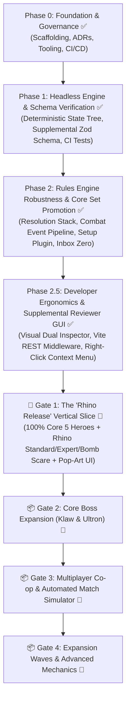

# Marvel Champions Digital (MCD) — Roadmap & Milestones

This document outlines the authoritative development roadmap for **Marvel Champions Digital**. It follows an iterative, **Capability-First, Headless-Engine Architecture**, ensuring the pure rules engine is proven out and verified with headless automated simulations before layering on visual polish and extended card sets.

---

## 🎯 Release Strategy & The "Rhino Release" Scope Boundary

To maximize delivery velocity, eliminate scope dispersion, and ship our first complete playable game loop, all development is organized into strict, sequential **Release Gates**:

- **🏁 Gate 1: The "Rhino Release" (Active Primary Milestone):**
  - **Objective:** Deliver a 100% polished, complete, and rules-verified playable vertical slice featuring **all 5 Core Heroes (101 Player Cards: Spider-Man, Captain Marvel, She-Hulk, Iron Man, Black Panther + 4 Aspects + Basic)** battling against the **Rhino Scenario (34 Encounter Cards: Rhino I/II/III, Standard, Expert, Bomb Scare, and 5 Nemesis Sets)**.
  - **Scope Boundary Invariant:** ALL active tasks, bug fixes, engine primitives, and card integrations must strictly target Core Set Player cards or Rhino Encounter cards. Non-Rhino villains (Klaw, Ultron) and expansion mechanics are strictly deferred. Localized technical debt or refactors are explicitly accepted to achieve complete vertical slice closure.
- **📦 Gate 2: Core Boss Expansion (Klaw & Ultron):** Klaw scenario + Masters of Evil modular set; Ultron scenario + Under Attack modular set.
- **📦 Gate 3: Multiplayer Co-op & Headless Simulator (2–4 Player Tabletop):** Ask-another-player triggers, Alliance pooling, Team-Up prerequisites, and 100-game headless Monte Carlo match verification.
- **📦 Gate 4: Official Expansion Waves & Advanced Mechanics (v1.1+):** Incremental Hero/Scenario packs, Player Side Schemes, Multi-Form 3-sided identities, and Universal 51-Counter Engine.

---

## 🏷️ Feature Prioritization Framework

All uncompleted and future roadmap items are categorized using the following priority scale:

| Level  | Badge                        | Description                                                                                              | Target            |
| :----- | :--------------------------- | :------------------------------------------------------------------------------------------------------- | :---------------- |
| **P0** | `🔴 [Must-Have]`             | **Rhino Release Blocker:** Non-negotiable for a complete, 100% playable Rhino vs. Core Heroes vertical slice. | Current Sprint (Gate 1) |
| **P1** | `🟠 [Should-Have]`           | **High Priority / Polish:** Essential UX, interactive modals, and key ergonomics for the Rhino Release. | Gate 1 Polish     |
| **P2** | `🟡 [Nice-to-Have]`          | **Post-Rhino Expansion:** Klaw & Ultron bosses, extra modular sets, and audio/visual flourishes.         | Gate 2 & Gate 3   |
| **P3** | `🔵 [Future / Expansion]`    | **Expansions & Ecosystem:** Player Side Schemes, 3-sided heroes, campaign decks, native desktop binaries. | Gate 4+           |

---

## 🗺️ High-Level Roadmap Architecture

---

## 📍 Phase 0: Project Inception & Foundation ✅ (Completed)

- [x] **Architecture Decision Records (ADRs):** ADR-0001 through ADR-0029 created and indexed.
- [x] **Technology Selection:** TypeScript 5 + React 18 + Tailwind CSS + Vitest + Vite.
- [x] **Open-Source Governance:** MIT License, README, CONTRIBUTING, CODE_OF_CONDUCT, SECURITY, and CI workflow.
- [x] **Tooling & Scaffolding:** Vite 5, TypeScript 5, Vitest, Tailwind with Comic Theme, smoke tests verified.

---

## 📍 Phase 1: Headless Rules Engine & Schema Verification ✅ (Completed)

- [x] **Card Data Models & MarvelsDB Ingestion:** Ingest all Core Set cards with normalized schemas.
- [x] **Authoritative Zod Supplemental Schema (`schema.ts`):** Complete validation for `CardEnrichment`, `CardAbility`, `AbilityCost`, `FilterSchema`, `ConditionGate`, and `CardAuditRecord`.
- [x] **Automated Schema CI/CD Tests:** `tests/data/supplemental-schema.test.ts` validating 100% of supplemental packs.
- [x] **Modular Documentation Hub:** 10-part specification suite in `docs/specifications/supplemental/` with 🟢 `IMPLEMENTED` vs 🟡 `ROADMAP` status badges.
- [x] **Declarative Sequencing & Generic Zone Primitives (ADR-0028 & ADR-0029):** Atomic multi-step sequences (`steps: []`, renamed from `sequence: []` by ADR-0030), conditional gates (`gate: "ALWAYS" | "THEN" | "IF_AMOUNT_ZERO" | "IF_ALREADY_HAS_STATUS" | "IF_FAILED"`), and generic zone transfer primitives (`PUT_INTO_PLAY`, `SHUFFLE_INTO_DECK`).
- [x] **100% Core Set Encounter Pool Parity:** Multi-Stage Villain transitions (I $\rightarrow$ II $\rightarrow$ III), Option 3 Extra Activations (_Advance_, _Assault_, _Gang-Up_, _Explosion_, _Masterplan_, _Under Fire_), and Nemesis Spawning pipeline (_Shadow of the Past_ `01190`).
- [x] **Mulligan Rules Alignment (RR v1.8 p. 23):** Discard pile placement with top replacement draws.
- [x] **Ergonomics & Action Engine:** 1960s Daily Bugle Action Dispatcher (`DailyBugleActionNewspaper.tsx`), form-aware Identity Action Modal (`IdentityActionModal.tsx`), and Dynamic Fan-Out Stack Hand layout (`useHandFanLayout.ts`).

---

## 📍 Phase 2: Rules Engine Robustness & Capability-Driven Pipeline ✅ (Completed)

_Objective: Build an industrial-grade, capability-driven rules engine with complete nested resolution, a unified combat event pipeline, standardized scenario setup, and 100% Core Set card pool promotion (Inbox Zero)._

### 1. 🔴 `[Must-Have]` Completed Engine Foundations

- [x] **Interleaved Villain Phase Activations (RR v1.8 p. 22):**
  - Structured Step 2/3 as a unified player-by-player loop starting from the First Player.
- [x] **Sequential Hazard Icon Distribution (RR v1.8 p. 11) & Heroic Mode:**
  - Distributed extra encounter cards from Hazard icons sequentially in player order starting from the First Player (round-robin).
- [x] **Turn-Gated Form Changes (RR v1.8 p. 8):**
  - Basic 1/round form change limit tracked via `basicChangeFormUsedThisRound` with automatic reset on `ROUND_BEGAN`.

### 2. 🔴 `[Must-Have]` Milestone 2A: Universal Resolution Stack & Decision Prompt Queue ([ADR-0032](decisions/0032-universal-resolution-stack-decision-prompt-queue-and-nested-interrupts.md)) ✅ (Completed)

- [x] **Nested Action & Trigger Execution Stack (RR v1.8 p. 16, 24 / [ADR-0032](decisions/0032-universal-resolution-stack-decision-prompt-queue-and-nested-interrupts.md)):**
  - Supported interruption windows and execution frames (`ExecutionFrame`, `executionStack`) without state corruption.
  - Supported voluntary reaction windows with explicit "Pass / Do Nothing" options in `DecisionPromptModal`.
- [x] **Decision Prompt Queue Management:**
  - Transitioned from single prompt overwrite to structured FIFO prompt queue (`pendingDecisionQueue`), ensuring multiple triggered prompts resolve sequentially with visual queue depth badges.
- [x] **Promoted 5 Ambiguity Cards to 100% Confidence:** _Emergency_ (`01085`), _Great Responsibility_ (`01061`), _Get Behind Me!_ (`01078`), _One-Two Punch_ (`01024`), _Counter-Punch_ (`01077`).

### 3. 🔴 `[Must-Have]` Milestone 2B: Comprehensive Combat, Enemy Attack & Multi-Window Defense Pipeline ([ADR-0031](decisions/0031-comprehensive-combat-enemy-attack-and-multi-window-defense-pipeline.md)) ✅ (Completed)

- [x] **Sub-Milestone 2B-1: Core Combat Lifecycle & Defender Declaration Engine ✅ (Completed):**
  - Built modular 7-step combat pipeline in `src/engine/pipeline/combat-pipeline.ts` ([ADR-0031](decisions/0031-comprehensive-combat-enemy-attack-and-multi-window-defense-pipeline.md)).
  - Step 1 Stun/Webbed Up check & Step 2 Initiation triggers (`VILLAIN_INITIATES_ATTACK` / _Spider-Sense_ card draw).
  - Step 3 `DECLARE_DEFENDER` modal prompt with Basic Hero Defend (DEF mitigation), Ally Block, and Take Undefended.
  - Headless synchronous execution helper with configurable defense policy (`TAKE_UNDEFENDED`, `HERO_IF_READY`, `ALLY_CHUMP_BLOCK`, `AUTO_OPTIMAL`).
  - Promoted _Armored Vest_ (`01081`) and _Indomitable_ (`01082`) to 100% confidence.
- [x] **Sub-Milestone 2B-2: 0-to-Many Boost Queue, Star Abilities (★) & Boost Interrupts ✅ (Completed):**
  - Step 4 facedown boost deal queue ($N \ge 0$) and Step 5 iterative 1-by-1 boost reveal loop.
  - Boost Interrupt window (`WHEN_BOOST_CARD_REVEALED` / _Defiance_, _Target Acquired_).
  - ★ Star Boost abilities engine & dynamic boost card chaining (_Titania's Fury_ `01164`, _Sweeping Swoop_ `01168`, _Electric Whip Attack_ `01173`, _Kree Manipulator_ `01178`).
- [x] **Sub-Milestone 2B-3: Damage Prevention, Overkill, Retaliate & Direct Damage Invariant ✅ (Completed):**
  - Step 6 Damage Prevention Interrupts (_Backflip_ `01003`, _Cosmic Flight_ `01017`) and Tough preservation.
  - Overkill excess damage routing (bidirectional: Enemy $\rightarrow$ Defending Ally $\rightarrow$ Hero, Player $\rightarrow$ Minion $\rightarrow$ Villain) and `RETALIATE X` return damage in Step 7.
  - Direct damage vs. attack damage invariant (`dealDirectDamage`).
  - Promotes 8 Core Set cards: _Backflip_ (`01003`), _Enhanced Spider-Sense_ (`01004`), _Cosmic Flight_ (`01017`), _Gamma Slam_ (`01021`), _Hulk_ (`01050`), _Tigra_ (`01051`), _Relentless Assault_ (`01053`), _Uppercut_ (`01054`).

### 4. 🔴 `[Must-Have]` Milestone 2C: Scenario Setup & Modular Plugin Pipeline ([ADR-0033](decisions/0033-official-15-step-scenario-setup-engine-and-modular-plugin-pipeline.md)) ✅ (Completed)

- [x] **Official 15-Step Scenario Setup Engine (RR v1.8 p. 27–28 / [ADR-0033](decisions/0033-official-15-step-scenario-setup-engine-and-modular-plugin-pipeline.md)) ✅ (Completed):**
  - Refactored scenario initialization into declarative plug-in modules (`createGame(scenarioConfig, playerConfigs)`).
  - Enforced strict encounter set taxonomy: Scenario-Mandatory Sets (Villain set, Standard/Expert set) vs. Customizable Modular Slots.
  - Executed Main Scheme Stage 1A setup instructions (Permanent cards in play, villain placement, initial threat, starting side schemes, environments, attachments, encounter deck compilation, and player dealing) using generic zone primitives.
  - Standardized scenario plugins for Rhino, Klaw, and Ultron with plug-and-play modular encounter sets (_Bomb Scare_, _Masters of Evil_, _Under Attack_, _Legions of Hydra_, _The Doomsday Chair_).
- [x] **Scenario Selection Screen & Modular Set Customizer (`ScenarioSelector.tsx`) ✅ (Completed):**
  - Updated `ScenarioSelector.tsx` to display locked scenario-mandatory set badges (`[🔒 MANDATORY]`).
  - Added modular encounter set slot selectors pre-populated with scenario default recommendations (e.g. _Bomb Scare_ for Rhino, _Masters of Evil_ for Klaw, _Under Attack_ for Ultron), allowing players to replace optional sets with any modular set in their collection.
  - Provided a "Reset to Defaults" button and passed `selectedModularSetCodes` in `SetupSelection`.

### 5. 🔴 `[Must-Have]` Milestone 2D: Table Invariants, Deck Exhaustion & Core Set Promotion Pass (Inbox Zero) ✅ (Completed)

- [x] **Universal SEARCH_AND_SELECT Two-Pile Destination Routing & Specific Card Picking (RR v1.8 p. 19, 26 / [ADR-0030](decisions/0030-unified-ability-step-sequence-architecture.md) / [Issue #10](https://github.com/SteveRodrigue/MCD/issues/10)) ✅ (Completed):**
  - Implemented universal declarative `SEARCH_AND_SELECT` effect primitive and resolution dispatcher in `src/engine/effects/index.ts` and `src/engine/pipeline/action-dispatcher.ts`.
  - Supports Top-$N$ Look & Split (`lookCount: N`, `selectedDestination: "HAND"`, `unselectedDestination: "DISCARD"` / `"DECK_BOTTOM"` / `"DECK_TOP"`).
  - Enforced strict deck order preservation when returning looked cards to `DECK_TOP` / `DECK_BOTTOM` (RR v1.8 p. 19).
  - Supports targeted search and specific card picking (`unselectedDestination: null`, `shuffleAfter: true`, RR v1.8 p. 26).
  - Retrofitted Tony Stark (_Futurist_ `01029b`) to declarative schema.
- [x] **Restricted Card Keyword Limit Engine (RR v1.8 p. 25 / [ADR-0018](decisions/0018-declarative-state-modifiers-and-dynamic-board-limits.md) / [Issue #30](https://github.com/SteveRodrigue/MCD/issues/30)) ✅ (Completed):**
  - Implemented dynamic restricted limit calculator (`getPlayerRestrictedLimit`, base 2).
  - Supported heavy item weights ("Counts as 2 restricted cards", e.g. _Bazooka_, _Nightcrawler's Blades_).
  - Supported dynamic limit expansion modifiers (e.g. _Side Holster_, _Venom_, _Prehensile Tail_).
  - Validated voluntary discard replacement policy in `canPlayCard()` when playing a restricted card at capacity.
- [x] **Global Unique Card Rule & Identity Collision (RR v1.8 p. 29 / [Issue #31](https://github.com/SteveRodrigue/MCD/issues/31)) ✅ (Completed):**
  - Evaluated uniqueness globally across all active player tableaus, all player allies, and all in-game **Hero / Alter-Ego identities** (e.g. preventing _Captain Marvel_ ally when _Carol Danvers_ identity is in the game).
- [x] **Mid-Action Player & Encounter Deck Exhaustion Invariants (RR v1.8 p. 11, 18 / [Issue #32](https://github.com/SteveRodrigue/MCD/issues/32)) ✅ (Completed):**
  - Guaranteed immediate discard pile reshuffle and penalty application (1 acceleration token on main scheme for encounter deck; 1 facedown encounter card dealt to player for player deck) at any point during turn execution, milling, or card draws (`drawPlayerCard`, `drawEncounterCard`, `discardFromEncounterDeckUntil`, `discardFromPlayerDeckUntil`).
- [x] **End of Player Phase Clean-Up & Voluntary Hand Discard (RR v1.8 p. 23 / [Issue #41](https://github.com/SteveRodrigue/MCD/issues/41)) ✅ (Completed):**
  - Implemented the official End of Player Phase clean-up sequence in a dedicated module (`src/engine/pipeline/player-phase-cleanup.ts`):
  - In player order starting from the First Player, prompts active players with voluntary multi-select discard decision prompts.
  - Draws up to effective hand size and readies identities, allies, and tableau upgrades/supports _before_ the Villain Phase begins.
- [x] **Cost Arrow Mandatory Resolution & Self-Damage Cost Primitives (RR v1.8 p. 8, 15 / [ADR-0041](decisions/0041-cost-arrow-mandatory-resolution-and-self-damage-costs.md) / [Issue #8](https://github.com/SteveRodrigue/MCD/issues/8) & [Issue #11](https://github.com/SteveRodrigue/MCD/issues/11)) ✅ (Completed):**
  - Automated mandatory cost resolution on `FORCED_RESPONSE` and `FORCED_INTERRUPT` triggers (_Superhuman Strength_ `01028` discard self + stun).
  - Integrated `BASIC_ATTACK_PERFORMED`, `ATTACK_RESOLVED`, and `THWART_RESOLVED` lifecycle triggers in `action-dispatcher.ts`.
  - Formalized direct character self-damage cost primitive (`cost.damageSelf`) in `cost-engine.ts` with automated ally defeat handling (_War Machine_ `01030`).
- [x] **Promoted 100% of Ambiguity Cards in `docs/ambiguities/` ([ADR-0021](decisions/0021-card-integration-workflow-and-composable-primitives.md), [ADR-0025](decisions/0025-architectural-subsystem-completion-and-mandatory-supplemental-review-pipeline.md), [ADR-0030](decisions/0030-unified-ability-step-sequence-architecture.md)) ✅ (Completed):**
  - Executed Card Integration Protocol across all 23 ambiguity files.
  - Promoted all cards to $\ge 98\%$ confidence with dedicated unit tests.
  - Pruned `docs/ambiguities/` to **0 files (Inbox Zero)**.
  - 100% Core Set Player Cards (all 5 Heroes: Spider-Man, Captain Marvel, She-Hulk, Iron Man, Black Panther) + 100% Encounter Pool executable in headless engine.

---

## 📍 Phase 2.5: Developer Ergonomics & Supplemental Reviewer GUI ✅ (Completed Pre-Rhino Tooling)

_Objective: Equip developers and card authors with an integrated visual editor and live reviewer GUI to accelerate Core Set card audits, verify declarative rules, and hot-reload supplemental JSON directly from the running application ([ADR-0045](decisions/0045-card-supplemental-editor-and-live-reviewer-gui.md), [Specification](specifications/tooling/card_supplemental_editor.md))._

### Milestones & Tasks:
- [x] **Step 1: Local Vite Dev Server REST Middleware (`/api/supplemental/*`) ([Issue #60](https://github.com/SteveRodrigue/MCD/issues/60)) ✅ (Completed):**
  - Implement `cardSupplementalEditorPlugin` in `vite.config.ts` handling `GET /api/supplemental/packs`, `GET /api/supplemental/cards`, `GET /api/supplemental/card/:code`, and `POST /api/supplemental/card/:code`.
  - Validate payloads against authoritative `CardEnrichmentSchema` (`schema.ts`) prior to disk writes.
  - Automatically stamp ISO timestamps (`updatedAt`, `reviewedAt`) and attribution (`reviewedBy: "developer"`).
- [x] **Step 2: Dual-Inspector Reviewer & Editor Workspace (`/editor`) ([Issue #61](https://github.com/SteveRodrigue/MCD/issues/61)) ✅ (Completed):**
  - Implement multi-criteria filter toolbar: Zzorba pack dropdown, encounter set dropdown, hero dropdown, aspect/affinity dropdown, and text search.
  - Left pane: Card gallery with status badges (100% Verified, Partial/Draft, Schema Error, Missing).
  - Center pane: Visual inspector rendering card art via `CardView` alongside raw upstream attributes and printed card text.
  - Deep-linking URL synchronization (`/editor?code=01001a`).
- [x] **Step 3: Visual Declarative Ability Builder & Live Schema Diagnostics ([Issue #63](https://github.com/SteveRodrigue/MCD/issues/63)) ✅ (Completed):**
  - Form builder mode for ability timing, event triggers, costs, limits, and steps with dynamic primitive parameter fields.
  - Raw JSON mode with syntax error markers and live client-side Zod validation against `CardEnrichmentSchema`.
  - Atomic Save action (`Ctrl+S` / Save button) updating disk JSON and triggering Vite HMR with session reset toast.
- [x] **Step 4: In-Game Tabletop Context Menu Integration ([Issue #62](https://github.com/SteveRodrigue/MCD/issues/62)) ✅ (Completed):**
  - Attach custom `onContextMenu` handler to all in-game `<CardView />` instances on the tabletop (Player Hand, Tableau, Villain Zone, Main Scheme, Side Schemes, Attachments).
  - Provide *"Open in Supplemental Editor"* action that launches `/editor?code=<cardCode>` in a new browser tab/window without losing active game state.

---

## 🏁 Gate 1: The "Rhino Release" Vertical Slice 🚧 (Active Primary Milestone)

_Objective: Complete, test, and ship a 100% polished, playable vertical slice featuring all 5 Core Heroes battling against the Rhino Scenario on Standard and Expert difficulty with full UI and headless simulation proof ([ADR-0002](decisions/0002-decoupled-headless-rules-engine.md), [ADR-0004](decisions/0004-visual-art-direction-comic-pop-art.md))._

### 1.1. 🔴 `[Must-Have]` Core Set Player Cards & Primitives (101 Cards — Inbox Zero)
- [x] **Universal Ability Step Sequencing & Cost Engine ([ADR-0024](decisions/0024-declarative-action-cost-engine-and-state-mutation-pre-checks.md), [ADR-0030](decisions/0030-unified-ability-step-sequence-architecture.md)):** Unified `steps: AbilityStep[]` pipeline with conditional gates (`ALWAYS`, `THEN`, `IF_AMOUNT_ZERO`, `IF_ALREADY_HAS_STATUS`, `IF_RESOURCE_MATCH`).
- [x] **Core Hero Signature Mechanics Completed:**
  - Spider-Man (`01001a/b`): Spider-Sense, Web-Shooter ([Issue #42](https://github.com/SteveRodrigue/MCD/issues/42)), Backflip, Enhanced Spider-Sense.
  - Captain Marvel (`01010a/b`): Rechannel ([Issue #2](https://github.com/SteveRodrigue/MCD/issues/2)), Commander targeting ([Issue #29](https://github.com/SteveRodrigue/MCD/issues/29)), Energy Channel, Cosmic Flight.
  - She-Hulk (`01019a/b`): Focused Rage, Legal Practice ([Issue #6](https://github.com/SteveRodrigue/MCD/issues/6)), Split Personality ([Issue #7](https://github.com/SteveRodrigue/MCD/issues/7)), Superhuman Strength ([Issue #8](https://github.com/SteveRodrigue/MCD/issues/8)), Gamma Slam ([Issue #5](https://github.com/SteveRodrigue/MCD/issues/5)).
  - Iron Man (`01029a/b`): Tech Hand Size ([Issue #9](https://github.com/SteveRodrigue/MCD/issues/9)), Futurist SEARCH_AND_SELECT ([Issue #10](https://github.com/SteveRodrigue/MCD/issues/10), [Issue #38](https://github.com/SteveRodrigue/MCD/issues/38)), Arc Reactor, Powered Gauntlets, Repulsor Blast ([Issue #12](https://github.com/SteveRodrigue/MCD/issues/12)), Pepper Potts ([Issue #13](https://github.com/SteveRodrigue/MCD/issues/13)), Stark Tower ([Issue #14](https://github.com/SteveRodrigue/MCD/issues/14)).
  - Black Panther (`01040a/b`): Setup ability ([Issue #16](https://github.com/SteveRodrigue/MCD/issues/16)), Wakanda Forever multi-upgrade resolution ([Issue #18](https://github.com/SteveRodrigue/MCD/issues/18)), Energy Daggers ([Issue #19](https://github.com/SteveRodrigue/MCD/issues/19)), Vibranium Suit ([Issue #20](https://github.com/SteveRodrigue/MCD/issues/20)), Ancestral Knowledge ([Issue #17](https://github.com/SteveRodrigue/MCD/issues/17)).
- [ ] **Remaining Core Player Card Issues:**
  - [ ] **[Issue #46](https://github.com/SteveRodrigue/MCD/issues/46):** `[BUG]: Helicarrier cost reduction` across all player card types.
  - [ ] **[Issue #45](https://github.com/SteveRodrigue/MCD/issues/45):** `[BUG]: Alpha Flight Station` discard and draw sequencing.
  - [ ] **[Issue #48](https://github.com/SteveRodrigue/MCD/issues/48):** `[FEAT]: prevent infinite loop` in circular trigger chains.
  - [ ] **[Issue #49](https://github.com/SteveRodrigue/MCD/issues/49):** `[BUG]: reference to card.text in code` normalization.
  - [x] **[Issue #52](https://github.com/SteveRodrigue/MCD/issues/52):** `[FEAT]: Supplemental Data Schema - validation and helper` ([ADR-0043](decisions/0043-codebase-grounded-supplemental-schema-validation-and-live-vscode-integration.md)).
  - [x] **[Issue #53](https://github.com/SteveRodrigue/MCD/issues/53):** `feat(tooling): Card text parsing and declarative mapping analyzer tool` ([ADR-0044](decisions/0044-card-text-parsing-and-declarative-mapping-analyzer.md)).
  - [ ] **[Issue #25](https://github.com/SteveRodrigue/MCD/issues/25):** `feat(engine): PLAY_FROM_DISCARD primitive for Make the Call (01071)`.
  - [ ] **[Issue #24](https://github.com/SteveRodrigue/MCD/issues/24):** `feat(engine): until-end-of-phase temporary stat duration (Vision 01068)`.
  - [ ] **[Issue #23](https://github.com/SteveRodrigue/MCD/issues/23):** `feat(engine): Cross-player attachments & ownership (Combat Training 01057)`.
  - [ ] **[Issue #26](https://github.com/SteveRodrigue/MCD/issues/26):** `feat(engine): Cancel When Revealed + induce Villain attack (Get Behind Me! 01078)`.

### 1.2. 🔴 `[Must-Have]` Rhino Scenario & Encounter Pools (34 Cards)
- [x] **Rhino Villain Pipeline (Rhino I `01094`, II `01095`, III `01096`, The Break-In! 1A/1B `01097`):** Multi-stage HP scaling, Tough keyword on stage transition, and scheme acceleration.
- [x] **Standard & Expert Encounter Pools:**
  - Standard: *Advance* (`01186`), *Assault* (`01187`), *Caught Off Guard* (`01188`), *Gang-Up* (`01189`), *Shadow of the Past* (`01190`).
  - Expert: *Exhaustion* (`01191`), *Masterplan* (`01192`), *Under Fire* (`01193`).
- [x] **Bomb Scare Modular Set (Default Recommended):** *Bomb Scare* (`01108`), *Hydra Bomber* (`01110`), *False Alarm* (`01109`), *Explosion* (`01111`).
- [x] **5 Core Hero Nemesis Sets:** Vulture / Highway Robbery (Spider-Man), Yon-Rogg / The Yon-Rogg Incident (Captain Marvel), Titania / Personal Vendetta (She-Hulk), Whiplash / Imminent Meltdown (Iron Man), Killmonger / Usurp the Throne (Black Panther).
- [ ] **[Issue #36](https://github.com/SteveRodrigue/MCD/issues/36):** Centralize dynamic formula evaluator for state tokens (*Explosion* threat scaling, *Jessica Jones* side scheme scaling).

### 1.3. 🟠 `[Should-Have]` Comic Tabletop UI & Ergonomics
- [x] **Pop-Art Combat Modals:** Interactive `AttackTargetModal.tsx`, `IdentityActionModal.tsx`, `DecisionPromptModal.tsx`, and Defender declaration window.
- [x] **Dynamic Hand & Zone Displays:** Fan-out hand cards, vertical scheme threat gauge, and hero tableau layout.
- [ ] **[Issue #50](https://github.com/SteveRodrigue/MCD/issues/50):** `[IMPROVEMENT] Adjust UI layout in multiplayer (2+ hero board)` for clean tabletop layout.
- [ ] **[Issue #4](https://github.com/SteveRodrigue/MCD/issues/4):** `feat(ui): Display active and dynamic traits on card hover/mouseover`.
- [ ] **Interactive Card Play & Resource Payment Modal:** High-contrast generator tapping and double-resource auto-selection.

### 1.4. 🔴 `[Must-Have]` Automated 100-Game Headless Match Simulation Gate
- [ ] **Monte Carlo Verification Suite (`tests/engine/match-simulator.test.ts`):**
  - Automated headless runner executing 100 complete simulated games (Spider-Man, Captain Marvel, She-Hulk, Iron Man, Black Panther) against Rhino on Standard and Expert.
  - Asserts zero state corruption, zero deadlocks, and verified win/loss condition evaluations.

---

## 📦 Gate 2: The Core Boss Expansion (Klaw & Ultron) 📅 (Planned Next)

_Objective: Expand the Core Set scenario catalog to include Klaw and Ultron bosses with their unique encounter mechanics ([ADR-0033](decisions/0033-official-15-step-scenario-setup-engine-and-modular-plugin-pipeline.md))._

### Milestones & Tasks:
- [ ] **Klaw Scenario Plugin (`klaw` - 17 cards) & Masters of Evil (`masters_of_evil` - 6 cards):**
  - 2 boost cards per attack, sonic convergence weapons, minion horde spawning.
- [ ] **Ultron Scenario Plugin (`ultron` - 22 cards) & Under Attack (`under_attack` - 4 cards):**
  - Facedown drone deck attachments, drone minion state machine, Invulnerable keyword.
- [ ] **Modular Scenario Customizer:** Free mix-and-match of *Bomb Scare*, *Masters of Evil*, and *Under Attack*.

---

## 📦 Gate 3: Multiplayer Co-op & Ecosystem 📅 (Planned)

_Objective: Scale to 2–4 players cooperative tabletop with collaborative triggers and community deck import ([ADR-0014](decisions/0014-marvelcdb-deck-schema-and-metadata-decks.md), [ADR-0032](decisions/0032-universal-resolution-stack-decision-prompt-queue-and-nested-interrupts.md))._

### Milestones & Tasks:
- [ ] **[Issue #37](https://github.com/SteveRodrigue/MCD/issues/37):** `Alliance` keyword collaborative resource pooling and `Team-Up` dual-identity prerequisites.
- [ ] **Cross-Player Cooperative Actions:** "Action: Ask another player to..." resolution stack prompts.
- [ ] **1-Click MarvelCDB Community Deck Import:** Direct deck loading via REST API.
- [ ] **Native Desktop Packaging (Tauri):** Standalone lightweight binaries for Windows, Mac, and Linux.

---

## 📦 Gate 4: Expansion Waves & Advanced Mechanics 📅 (Planned)

_Objective: Scale the engine to support official expansion waves, campaign expansions, and advanced card archetypes ([ADR-0034](decisions/0034-player-side-schemes-victory-display-and-auxiliary-decks.md), [ADR-0035](decisions/0035-universal-multi-form-identities-and-generic-counter-engine.md), [ADR-0036](decisions/0036-advanced-status-card-dynamics-and-minion-activations.md))._

### Milestones & Tasks:
- [x] **[ADR-0034](decisions/0034-player-side-schemes-victory-display-and-auxiliary-decks.md) / [Issue #34](https://github.com/SteveRodrigue/MCD/issues/34):** Player Side Schemes, persistent Victory Display, and auxiliary campaign decks.
- [x] **[ADR-0035](decisions/0035-universal-multi-form-identities-and-generic-counter-engine.md) / [Issue #33](https://github.com/SteveRodrigue/MCD/issues/33):** Universal 51-counter engine and multi-form identities.
- [x] **[ADR-0036](decisions/0036-advanced-status-card-dynamics-and-minion-activations.md) / [Issue #35](https://github.com/SteveRodrigue/MCD/issues/35):** Stalwart/Steady status dynamics and minion activation modifiers.
- [ ] **Official Pack Integration Pipeline:** Captain America, Ms. Marvel, Thor, Doctor Strange, Rise of Red Skull, Galaxy's Most Wanted, Sinister Motives, Mutant Genesis, Next Evolution, Age of Apocalypse.

---

## ⚠️ Known Upstream Data Caveats & Upstream PR Backlog

### 1. 🟡 `[Low-Priority Backlog]` Zzorba Core Set Main Scheme Inverted Image Naming Quirk

- **Context:** In the upstream `zzorba/marvelsdb-json-data` Core Set encounter pack (`core_encounter.json` / pack code `01`), the asset file mapping for Main Scheme cards is inverted compared to all subsequent expansion sets:
  - **Core Set (`01xxx`):** Stage 1A (Setup face) maps to image `xxxxb.png`, while Stage 1B (Active threat face) maps to image `xxxx.png`.
  - **All Other Expansions (`02xxx`, `16xxx`, `24xxx`, etc.):** Stage A maps to `xxxx.png` (or `xxxxa.png`), while Stage B maps to `xxxxb.png`.
- **MCD Handling:** Encapsulated in [`resolveMainSchemeArtFileName()`](../src/ui/services/card-cache-service.ts) in `src/ui/services/card-cache-service.ts`.
- **Action Item:** Consider submitting a PR / issue upstream to `zzorba/marvelsdb-json-data` to standardize Core Set image naming conventions (Low priority).
