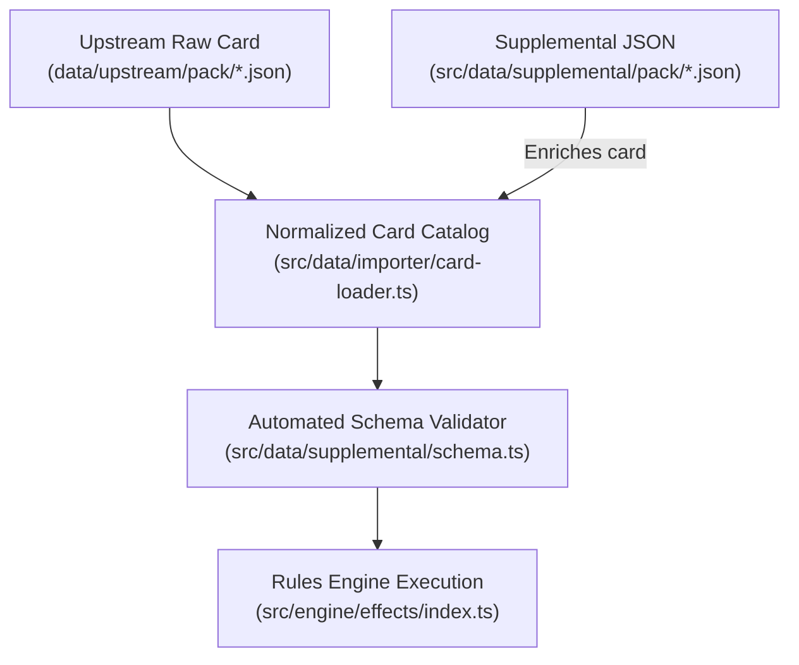

# Supplemental Data Schema Specification

> [!IMPORTANT]
> **Authoritative Specification & Single Source of Truth:**  
> This specification defines the complete declarative schema for the supplemental layer (`src/data/supplemental/`). All built-in cards, community fan-made content, and AI skill runs (`card-integration-protocol`) MUST adhere strictly to the contracts defined in this documentation suite.
>
> All supplemental files are automatically validated during CI/CD via `tests/data/supplemental-schema.test.ts`.

---

## 🏷️ Implementation Status Legend

To ensure complete clarity between what is **currently executable** in the engine vs **planned roadmap** features, every primitive in this documentation suite carries an explicit status badge:

- 🟢 **`IMPLEMENTED (v1.0)`**: Fully wired in `src/engine/effects/` and verified with automated regression test suites.
- 🟡 **`ROADMAP / SPECIFIED`**: Designed and specified for upcoming engine integration. Direct link to the corresponding GitHub Issue # provided.

---

## 📚 Specification Modules

| Module                                                       | Title                        | Topics Covered                                                                                          |
| :----------------------------------------------------------- | :--------------------------- | :------------------------------------------------------------------------------------------------------ |
| [**01. Metadata & Audit**](./01_metadata_and_audit.md)       | JSON Root & Quality Trail    | `CardEnrichment`, `CardAuditRecord`, `mechanicSteps`, `errata` overlays.                                |
| [**02. Timings & Triggers**](./02_timings_and_triggers.md)   | Lifecycle & Event Windows    | `AbilityTiming` (Action, Interrupt, Response, Constant, etc.), `TriggerType` matrix.                    |
| [**03. Costs & Targeting**](./03_costs_and_targeting.md)     | Prerequisites & Selection    | `AbilityCost` (resources, exhaust, damage, discard), `TargetSelector`, exhaustive `FilterSchema`.       |
| [**04. Combat & Threat**](./04_effects_combat_threat.md)     | Damage & Scheme Control      | `DEAL_DAMAGE`, `REMOVE_THREAT`, `ADD_THREAT`, Overkill, Piercing, Guard, Crisis.                        |
| [**05. Zones & Cards**](./05_effects_zones_cards.md)         | Hand, Deck & Discard Moves   | `DRAW_CARDS`, `MODIFY_HAND_SIZE`, `SEARCH_AND_SELECT`, `DISCARD`, `PUT_INTO_PLAY`. |
| [**06. Status & Economy**](./06_effects_status_economy.md)   | Conditions & Orientation     | `ADD_STATUS`, `EXHAUST`, `READY`, `GENERATE_RESOURCE`, `DOUBLE_RESOURCE_FOR_ASPECT`, Toughness keyword. |
| [**07. Villain & Nemesis**](./07_effects_villain_nemesis.md) | Activations & Encounter Sets | `VILLAIN_SCHEMES`, `VILLAIN_ATTACKS`, `SPAWN_NEMESIS`, `ATTACH_TO_HOST`.                                |
| [**08. Dynamic Formulas**](./08_dynamic_formulas.md)         | Mathematical Expressions     | `amountCalculated`, dynamic state tokens, scaling multipliers, and min/max clamps.                      |
| [**09. Sequences & Modals**](./09_sequences_and_prompts.md)  | Chaining & Player Choices    | `steps: []` multi-action arrays, `PLAYER_CHOICE` Pop-Art decision prompt modals.                        |

---

## 🏗️ Architecture & Processing Flow

---

## 🔗 Related Documentation

- [Hero & Identity Creation Guide](../../guidelines/hero_creation_guide.md)
- [Scenario Creation & Extensibility Guide](../../guidelines/scenario_creation_guide.md)
- [Card Integration Protocol (SKILL.md)](../../../.agents/skills/card-integration-protocol/SKILL.md)
