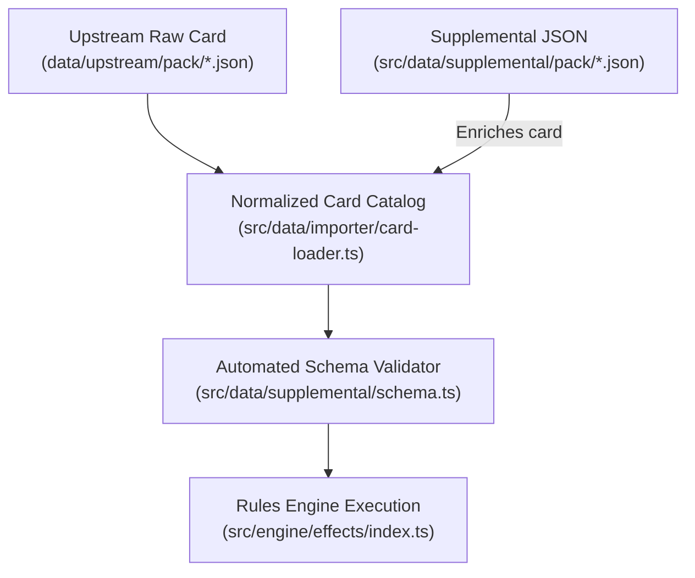

# Supplemental Data Schema Specification

> [!IMPORTANT]
> **Authoritative Specification & Single Source of Truth:**  
> This specification defines the complete declarative schema for the supplemental layer (`src/data/supplemental/`). All built-in cards, community fan-made content, and AI skill runs (`card-integration-protocol`) MUST adhere strictly to the contracts defined in this documentation suite.
>
> All supplemental files are automatically validated during CI/CD via `tests/data/supplemental-schema.test.ts`.

---

## 🏛️ Codebase Grounding & Single Source of Truth

Every primitive, trigger, timing, cost, and parameter documented in this specification suite is **100% grounded in the active codebase** (`src/data/supplemental/schema.ts`, `src/engine/effects/index.ts`, and `src/engine/triggers/`). There are no speculative or unimplemented roadmap primitives; all documented features are fully executable and verified via automated regression test suites.

---

## 📚 Specification Modules

| Module                                                         | Title                         | Topics Covered                                                                                                           |
| :------------------------------------------------------------- | :---------------------------- | :----------------------------------------------------------------------------------------------------------------------- |
| [**01. Metadata & Audit**](./01_metadata_and_audit.md)         | JSON Root & Quality Trail     | `CardEnrichment`, `CardAuditRecord`, `errata` overlays.                                                                  |
| [**02. Timings & Triggers**](./02_timings_and_triggers.md)     | Lifecycle & Event Windows     | `AbilityTiming` (Action, Interrupt, Response, Constant, etc.), `TriggerType` matrix.                                     |
| [**03. Costs & Targeting**](./03_costs_and_targeting.md)       | Prerequisites & Selection     | `AbilityCost` (resources, exhaust, damage, discard), `TargetSelector`.                                                   |
| [**04. Universal Card Filter**](./04_universal_card_filter.md) | Universal Declarative Filters | Canonical `UniversalCardFilterSchema`, `traits`, `types`, `aspects`, `cost`, boolean combinators (`all`, `any`, `none`). |
| [**05. Combat & Threat**](./05_effects_combat_threat.md)       | Damage & Scheme Control       | `DEAL_DAMAGE`, `REMOVE_THREAT`, `ADD_THREAT`, Overkill, Piercing, Guard, Crisis.                                         |
| [**06. Zones & Cards**](./06_effects_zones_cards.md)           | Hand, Deck & Discard Moves    | `DRAW`, `MODIFY_HAND_SIZE`, `SEARCH`, `DISCARD`, `PUT_INTO_PLAY`.                                                        |
| [**07. Status & Economy**](./07_effects_status_economy.md)     | Conditions & Orientation      | `ADD_STATUS`, `EXHAUST`, `READY`, `GENERATE_RESOURCE`, `DOUBLE_RESOURCE_FOR_ASPECT`, Toughness keyword.                  |
| [**08. Villain & Nemesis**](./08_effects_villain_nemesis.md)   | Activations & Encounter Sets  | `VILLAIN_SCHEMES`, `VILLAIN_ATTACKS`, `ATTACH_TO_HOST`, canonical nemesis pipeline.                                      |
| [**09. Dynamic Formulas**](./09_dynamic_formulas.md)           | Mathematical Expressions      | `amountCalculated`, dynamic state tokens, scaling multipliers, and min/max clamps.                                       |
| [**10. Sequences & Modals**](./10_sequences_and_prompts.md)    | Chaining & Player Choices     | `steps: []` multi-action arrays, `PLAYER_CHOICE` Pop-Art decision prompt modals.                                         |
| [**11. Play Requirements**](./11_play_requirements.md)         | Form, Trait & Control Gates   | `PlayRequirementsSchema`, `identityForm`, `formTrait`, `identityTraits`, `controlFilter`, `identityNames`.               |

---

## 🏗️ Architecture & Processing Flow

---

## 🔗 Related Documentation

- [Visual Guides — Engine Flow Atlas](../../visual-guides/README.md) (diagram-first onboarding companion)
- [Hero & Identity Creation Guide](../../guidelines/hero_creation_guide.md)
- [Scenario Creation & Extensibility Guide](../../guidelines/scenario_creation_guide.md)
- [Card Integration Protocol (SKILL.md)](../../../.agents/skills/card-integration-protocol/SKILL.md)
