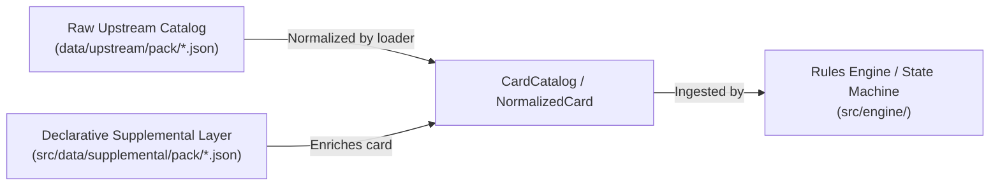

# Supplemental Data Schema & Card Ability Reference Specification

> [!IMPORTANT]
> **Authoritative Specification & Single Source of Truth:**  
> This specification defines the complete schema for the declarative supplemental layer (`src/data/supplemental/`). All built-in cards, fan-made custom content, and automated AI skill runs (`card-integration-protocol`) MUST adhere strictly to the contracts defined in this document.

---

## Table of Contents

1. [Architectural Overview & Philosophy](#1-architectural-overview--philosophy)
2. [JSON Root & Metadata Standard (`CardEnrichment`)](#2-json-root--metadata-standard-cardenrichment)
3. [Ability Timing & Trigger Matrix](#3-ability-timing--trigger-matrix)
4. [Ability Cost Engine (`AbilityCost`)](#4-ability-cost-engine-abilitycost)
5. [Targeting & Filter Primitives](#5-targeting--filter-primitives)
6. [Catalog of Effect Primitives](#6-catalog-of-effect-primitives)
   - [6.1 Combat & Damage](#61-combat--damage)
   - [6.2 Threat & Scheme Mechanics](#62-threat--scheme-mechanics)
   - [6.3 Card Draw, Hand & Zones](#63-card-draw-hand--zones)
   - [6.4 Status Cards & Conditions](#64-status-cards--conditions)
   - [6.5 Resource Economy](#65-resource-economy)
   - [6.6 Villain & Minion Extra Activations](#66-villain--minion-extra-activations)
   - [6.7 Spawning, Attachments & Form Manipulation](#67-spawning-attachments--form-manipulation)
   - [6.8 Interactive Decision Prompts](#68-interactive-decision-prompts)
7. [Dynamic Formulas & Mathematical Expressions](#7-dynamic-formulas--mathematical-expressions)
8. [Action Sequencing & Multi-Action Chaining](#8-action-sequencing--multi-action-chaining)
9. [Errata & Visual Overlays](#9-errata--visual-overlays)
10. [Validation & Conformance Checklist](#10-validation--conformance-checklist)

---

## 1. Architectural Overview & Philosophy

Marvel Champions Digital (MCD) separates static card catalog data from executable game mechanics:



### Core Principles
1. **Declarative over Imperative:** Cards declare *what* happens through structured JSON schemas (`abilities: CardAbility[]`). The engine handles the *how* (`src/engine/effects/`).
2. **Symmetric Extensibility:** Built-in core cards and community fan-made cards use the exact same schema, types, and effect primitives.
3. **Pessimistic Circuit-Breakers:** Cards with unverified or unsupported mechanics are stripped of active abilities and capped at `< 90%` confidence with an explicit ambiguity file generated in `docs/ambiguities/`.

---

## 2. JSON Root & Metadata Standard (`CardEnrichment`)

Each entry in a supplemental file (e.g. `src/data/supplemental/pack/core.json` or `core_encounter.json`) is keyed by the 5-to-6 character card code:

```json
{
  "cards": {
    "01001a": {
      "comment": "HERO: Spider-Man. Interrupt: When attacked, draw 1 card.",
      "abilities": [
        {
          "id": "spider_sense_interrupt",
          "timing": "INTERRUPT",
          "trigger": "ATTACK",
          "effect": "DRAW_CARDS",
          "params": {
            "count": 1
          }
        }
      ],
      "audit": {
        "createdAt": "2026-08-27T23:00",
        "updatedAt": "2026-08-28T14:40",
        "reviewedAt": "2026-08-28T14:40",
        "reviewedBy": "antigravity",
        "rulesVersion": "v1.8",
        "confidence": 98,
        "reconstructedText": "INTERRUPT (ATTACK) -> DRAW_CARDS (count: 1)"
      },
      "mechanicSteps": [
        "Spider-Sense: When the villain attacks you, draw 1 card."
      ],
      "errata": null
    }
  }
}
```

### Field Definitions

| Field | Type | Required | Description |
| :--- | :--- | :--- | :--- |
| `comment` | `string` | **Yes** | Human-readable explanation of card type, title, and mechanics. |
| `abilities` | `CardAbility[]` | **Yes** | Array of declarative ability objects. Empty array `[]` if passive card or unverified. |
| `audit` | `CardAuditRecord` | **Yes** | Complete audit and verification trail. |
| `audit.createdAt` | `string` | **Yes** | ISO-8601 timestamp with HH:MM (`YYYY-MM-DDTHH:MM`). |
| `audit.updatedAt` | `string` | **Yes** | ISO-8601 timestamp with HH:MM. |
| `audit.reviewedAt` | `string` | **Yes** | ISO-8601 timestamp of human/agent verification. |
| `audit.reviewedBy` | `string` | **Yes** | Identifier of reviewer (e.g. `"antigravity"`, `"community"`). |
| `audit.rulesVersion`| `string` | **Yes** | Marvel Champions Rules Reference version (e.g. `"v1.8"`). |
| `audit.confidence` | `number` | **Yes** | Confidence score from `0` to `100`. (Must be $\ge 95$ to prune ambiguity). |
| `audit.reconstructedText` | `string` | **Yes** | Pseudo-code markdown summary of active triggers and effects. |
| `mechanicSteps` | `string[]` | **Yes** | Granular step-by-step translation matching printed text. |
| `errata` | `string \| null` | No | Text override if card has official FFG ruling/errata. |

---

## 3. Ability Timing & Trigger Matrix

The `timing` field defines when an ability may be activated or when it intercepts game state:

| `timing` Value | Description | Player Form Gating |
| :--- | :--- | :--- |
| `'ACTION'` | Player-triggered action during their turn in the Player Phase. | Usable in either Hero or Alter-Ego form. |
| `'HERO_ACTION'` | Action restricted strictly to Hero form. | Hero form only (`player.currentForm === 'hero'`). |
| `'ALTER_EGO_ACTION'`| Action restricted strictly to Alter-Ego form. | Alter-Ego form only (`player.currentForm === 'alter_ego'`). |
| `'INTERRUPT'` | Optional reaction interrupting an event before it resolves (e.g. *Spider-Sense*, *Backflip*). | Checks trigger window. |
| `'FORCED_INTERRUPT'`| Mandatory reaction interrupting an event before it resolves. | Mandatory execution. |
| `'RESPONSE'` | Optional reaction occurring immediately after an event resolves. | Checks trigger window. |
| `'FORCED_RESPONSE'` | Mandatory reaction occurring immediately after an event resolves (e.g. *Sandman* mill, *Vulture* steal). | Mandatory execution. |
| `'WHEN_REVEALED'` | Mandatory encounter card trigger when flipped from the encounter deck or spawned. | Encounter context. |
| `'CONSTANT'` | Static/passive aura, ongoing effect, or stat modifier (e.g. *Iron Man* hand size, *Combat Training* ATK bonus). | Active while card remains face-up in play. |
| `'SETUP'` | Trigger executed during Step 4/8 of Scenario Setup (e.g. *T'Challa* upgrade search). | Game initialization. |
| `'BOOST'` | Ability resolved when card is revealed as a Villain/Minion Boost card. | Step 2/3 Boost window. |

### `trigger` Event Windows

When `timing` is an Interrupt, Response, or When Revealed, `trigger` binds it to an engine event:

* `'WHEN_REVEALED'`: Card is being revealed from encounter deck / dealt pile.
* `'ATTACK'`: Character is declared as the target of an attack.
* `'MINION_ATTACKED'`: Minion completes an attack activation against a player.
* `'DAMAGE_TAKEN'`: Character suffers 1 or more damage.
* `'THREAT_PLACED'`: Threat is placed on a main or side scheme.
* `'HERO_FLIPPED'`: Player identity changes form (`Hero` $\leftrightarrow$ `Alter-Ego`).
* `'ROUND_END'`: Step 6 round upkeep commences.
* `'PHASE_START'`: Player Phase or Villain Phase begins.
* `'DEFEATED'`: Character or scheme is defeated / reduced to 0 health or threat.

---

## 4. Ability Cost Engine (`AbilityCost`)

The optional `cost` object on a `CardAbility` declares requirements before the action can be initiated:

```json
"cost": {
  "exhaustSelf": true,
  "resources": ["energy"],
  "damageHero": 1,
  "spendTokens": {
    "type": "charge",
    "count": 2
  }
}
```

### Supported Cost Fields

| Field | Type | Description |
| :--- | :--- | :--- |
| `exhaustSelf` | `boolean` | Card must be ready and exhausts upon activation. |
| `exhaustCard` | `TargetSelector` | Another specific card must exhaust (e.g. `"SELF_IDENTITY"`). |
| `resources` | `ResourceType[]` | Array of specific printed resource icons required (`'physical'`, `'energy'`, `'mental'`, `'wild'`). |
| `resourceCost` | `number` | Generic resource cost of any combination. |
| `damageHero` | `number` | Direct damage hero must suffer to pay the cost (e.g. *War Machine*). |
| `discardCard` | `object` | `{ "count": number, "from": "HAND" \| "DECK" \| "PLAY" }`. |
| `spendTokens` | `object` | `{ "type": string, "count": number }` — Decrements tokens from card. |
| `costCheck` | `string` | Expression ensuring the effect changes state (e.g. `CURRENT_HEALTH < MAX_HEALTH` for heal). |

---

## 5. Targeting & Filter Primitives

### `TargetSelector` Enumeration

| Target Key | Resolved Entity |
| :--- | :--- |
| `'SELF'` | The card instance executing the ability. |
| `'SELF_IDENTITY'` | The player identity controlling the card. |
| `'ACTIVE_PLAYER'` | The player currently taking their turn in the Player Phase. |
| `'ALL_PLAYERS'` | Every player in the game session. |
| `'CHOSEN_PLAYER'` | Prompt the user to select 1 player. |
| `'VILLAIN'` | The currently active villain (`getActiveVillain(state)`). |
| `'MAIN_SCHEME'` | The currently active main scheme (`getActiveMainScheme(state)`). |
| `'SIDE_SCHEME'` | A chosen or all active side schemes. |
| `'CHOSEN_ENEMY'` | Player selects either the active Villain or any Minion in play. |
| `'ALL_ENEMIES'` | The active Villain and all minions across all player zones. |
| `'ENGAGED_MINIONS'` | All minions engaged with the resolving player. |
| `'CHOSEN_ALLY'` | Player selects 1 ally in play. |

### Filter Schema (`filter`)

Used for searching, counting, and validating targets across zones:

```json
"filter": {
  "type": "upgrade",
  "trait": "Tech",
  "aspect": "aggression",
  "zone": "tableau"
}
```

---

## 6. Catalog of Effect Primitives

### 6.1 Combat & Damage

#### `DEAL_DAMAGE`
Deals flat or calculated damage to target enemy.
```json
{
  "effect": "DEAL_DAMAGE",
  "params": {
    "amount": 8,
    "target": "CHOSEN_ENEMY",
    "overkill": true,
    "piercing": false,
    "ranged": false
  }
}
```

#### `DEAL_DAMAGE_SPLIT`
Divides damage among multiple chosen targets.
```json
{
  "effect": "DEAL_DAMAGE_SPLIT",
  "params": {
    "totalDamage": 4,
    "target": "ALL_ENEMIES"
  }
}
```

#### `RETALIATE` / `QUICKSTRIKE`
Passive keywords translated to declarative combat responses.

---

### 6.2 Threat & Scheme Mechanics

#### `REMOVE_THREAT`
Removes threat from main scheme, side scheme, or chosen scheme.
```json
{
  "effect": "REMOVE_THREAT",
  "params": {
    "amount": 3,
    "target": "MAIN_SCHEME"
  }
}
```

#### `PLACE_THREAT`
Places threat on scheme.
```json
{
  "effect": "PLACE_THREAT",
  "params": {
    "amount": 2,
    "perPlayer": true,
    "target": "MAIN_SCHEME"
  }
}
```

#### `PLACE_THREAT_PER_SIDE_SCHEME`
Places threat on each side scheme; if none exist, discards from encounter deck until a side scheme is found (*Masterplan* `01192`).

---

### 6.3 Card Draw, Hand & Zones

#### `DRAW_CARDS`
Draws cards for the target player.
```json
{
  "effect": "DRAW_CARDS",
  "params": {
    "count": 2,
    "target": "ACTIVE_PLAYER"
  }
}
```

#### `MODIFY_HAND_SIZE`
Constant aura modifying effective hand size dynamically (*Iron Man* `01029a` / *Symbiote Suit*).
```json
{
  "effect": "MODIFY_HAND_SIZE",
  "params": {
    "scaling": "PER_MATCHING_TABLEAU_CARD",
    "filter": {
      "type": "upgrade",
      "trait": "Tech"
    },
    "amountPerCard": 1,
    "maxHandSize": 7,
    "applicableForm": "hero"
  }
}
```

#### `SEARCH_AND_DRAW`
Looks at top N cards of deck, player chooses M cards to add to hand, remainder discarded (*Tony Stark* `01029b` / *Shuri* `01041`).
```json
{
  "effect": "SEARCH_AND_DRAW",
  "params": {
    "lookCount": 3,
    "chooseCount": 1,
    "destination": "HAND",
    "unselectedDestination": "DISCARD",
    "filter": {
      "trait": "Tech"
    }
  }
}
```

---

### 6.4 Status Cards & Conditions

#### `APPLY_STATUS` / `REMOVE_STATUS`
Applies or discards `STUNNED`, `CONFUSED`, or `TOUGH`.
```json
{
  "effect": "APPLY_STATUS",
  "params": {
    "status": "STUNNED",
    "target": "CHOSEN_ENEMY"
  }
}
```

---

### 6.5 Resource Economy

#### `RESOURCE_GENERATION`
Card exhausts or spends a counter to provide resources during a payment window (*Web-Shooter* `01008`, *Helicarrier* `01092`).
```json
{
  "effect": "RESOURCE_GENERATION",
  "params": {
    "resources": ["wild"]
  }
}
```

#### `DOUBLE_RESOURCE`
Doubles resource generation when spent on a matching aspect (*The Power of Aggression* `01055`).
```json
{
  "effect": "DOUBLE_RESOURCE",
  "params": {
    "matchingAspect": "aggression",
    "multiplier": 2
  }
}
```

---

### 6.6 Villain & Minion Extra Activations

#### `VILLAIN_SCHEMES` / `VILLAIN_ATTACKS`
Forces an immediate Villain scheme (*Advance* `01186`) or attack (*Assault* `01187`).
```json
{
  "effect": "VILLAIN_ATTACKS",
  "params": {
    "alterEgoSurge": true
  }
}
```

#### `VILLAIN_AND_ENGAGED_MINIONS_ATTACK`
Forces villain and all engaged minions to attack the hero (*Gang-Up* `01189`).

#### `EXPLOSION`
Deals damage equal to threat on a side scheme (*Bomb Scare* `01109`) or gains surge (*Explosion* `01111`).

---

### 6.7 Spawning, Attachments & Form Manipulation

#### `SPAWN_NEMESIS`
Spawns all set-aside nemesis minions and side scheme for the resolving hero, shuffles the remainder into the encounter deck, or surges if minions are unavailable (*Shadow of the Past* `01190`).
```json
{
  "effect": "SPAWN_NEMESIS",
  "params": {}
}
```

#### `ATTACH_TO_CHARACTER`
Attaches an upgrade or attachment to an enemy or player (*Webbed Up* `01009`, *Spider-Tracer* `01007`, *Inspired* `01074`).
```json
{
  "effect": "ATTACH_TO_CHARACTER",
  "params": {
    "target": "VILLAIN",
    "intercept": "ATTACK",
    "onIntercept": "DISCARD_AND_STUN"
  }
}
```

---

### 6.8 Interactive Decision Prompts

#### `PLAYER_CHOICE`
Renders an interactive Pop-Art decision modal and branches execution based on player selection.
```json
{
  "effect": "PLAYER_CHOICE",
  "params": {
    "promptTitle": "Nick Fury's Orders",
    "promptMessage": "Choose 1 of the following options:",
    "options": [
      {
        "id": "opt_remove_threat",
        "label": "Remove 2 threat from a scheme",
        "effect": "REMOVE_THREAT",
        "params": { "amount": 2, "target": "MAIN_SCHEME" }
      },
      {
        "id": "opt_draw_cards",
        "label": "Draw 3 cards",
        "effect": "DRAW_CARDS",
        "params": { "count": 3, "target": "SELF_IDENTITY" }
      },
      {
        "id": "opt_deal_damage",
        "label": "Deal 4 damage to an enemy",
        "effect": "DEAL_DAMAGE",
        "params": { "amount": 4, "target": "CHOSEN_ENEMY" }
      }
    ]
  }
}
```

---

## 7. Dynamic Formulas & Mathematical Expressions

For cards whose values depend on live game state (e.g. *Gamma Slam* `01021`, *Jessica Jones* `01059`):

### Supported Formula Tokens

* `PLAYER_MAX_HEALTH`: Max HP of player identity.
* `PLAYER_CURRENT_HEALTH`: Current HP of player identity.
* `SUFFERED_DAMAGE`: `PLAYER_MAX_HEALTH - PLAYER_CURRENT_HEALTH`.
* `SIDE_SCHEMES_IN_PLAY`: Total count of active side schemes.
* `TABLEAU_COUNT(filter)`: Number of cards matching filter in player's tableau.

### Example: Gamma Slam (`01021`)
```json
{
  "effect": "DEAL_DAMAGE",
  "params": {
    "amountCalculated": "SUFFERED_DAMAGE",
    "clamp": {
      "max": 15
    },
    "target": "CHOSEN_ENEMY"
  }
}
```

---

## 8. Action Sequencing & Multi-Action Chaining

When a card performs a sequence of discrete actions in order (e.g. *Split Personality* `01025`, *Get Behind Me!* `01078`), use the `sequence` array:

```json
{
  "id": "split_personality_action",
  "timing": "ACTION",
  "sequence": [
    {
      "effect": "FLIP_FORM",
      "params": {}
    },
    {
      "effect": "DRAW_UP_TO_HAND_SIZE",
      "params": {}
    }
  ]
}
```

---

## 9. Errata & Visual Overlays

If a printed card has received an official FFG FAQ ruling or text errata:
1. Preserve original printed text in catalog upstream.
2. Add the corrected text in the `errata` field in the supplemental JSON.
3. The UI automatically displays an **[ERRATA]** comic badge on the card zoom overlay.

---

## 10. Validation & Conformance Checklist

Before committing any card to `src/data/supplemental/`:
- [ ] Card code matches exactly (5–6 chars).
- [ ] `audit.createdAt` and `audit.updatedAt` use ISO format `YYYY-MM-DDTHH:MM`.
- [ ] `audit.rulesVersion` is set to `"v1.8"`.
- [ ] All `timing`, `trigger`, and `effect` strings match exact enums in this document.
- [ ] Regression unit tests in `tests/engine/` verify 100% of declared mechanics.
- [ ] Confidence score is elevated to $\ge 95\%$ and the corresponding file in `docs/ambiguities/` is deleted (Inbox Zero).
