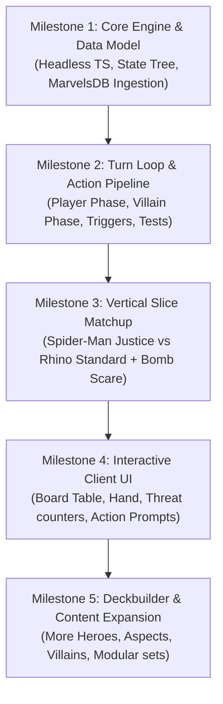

# Marvel Champions Digital (MCD) — Architecture & Technology Selection

## 1. Project Overview & Objectives

**Marvel Champions Digital (MCD)** aims to be a faithful, high-performance, and modular digital adaptation of *Marvel Champions: The Card Game* (by Fantasy Flight Games).

### Core Goals
1. **Accurate Rules & Timing Engine:** Support the full hierarchy of triggers (*Constant Abilities, Forced Interrupts, Interrupts, Forced Responses, Responses, Resource Windows, Replacement Effects*).
2. **Data-Driven Card Implementation:** Ingest and expand upon public card database definitions (e.g. `marvelsdb-json-data`).
3. **Decoupled Architecture (Headless Core Engine):** The engine must be 100% independent of any UI/rendering library, allowing 100% deterministic unit testing, headless simulations, and flexible frontend swapping.
4. **100% Free & Open Source (FOSS) & Zero Proprietary Lock-In:** Because Marvel Champions is a licensed IP belonging to Marvel/Disney and Fantasy Flight Games, this project must remain a free, non-commercial fan project. The tech stack must use permissive open-source licenses (MIT, Apache-2.0), have zero licensing fees or seat fees, require no forced splash screens, and allow community contributions.
5. **Rich Interactive UI:** Fluid card play, smooth animations (discard, draw, damage counters, boost reveals), board inspection, and intuitive prompt systems.
6. **Multiplayer & Solo Capability:** Seamless Solo/Two-Handed play initially, with an architecture capable of expanding to network multiplayer.

---

## 2. Architectural Design: Decoupled Engine Model

```
+-----------------------------------------------------------------------+
|                              UI / Client Layer                        |
|  (React + Canvas / Pixi.js / Godot / Svelte / WebGL View)             |
+-----------------------------------+-----------------------------------+
                                    |
                           Action & State API
                        (Dispatch Actions / Events)
                                    |
                                    v
+-----------------------------------------------------------------------+
|                         Core Game Engine (Headless)                   |
|                                                                       |
|  +------------------------+  +-------------------------------------+  |
|  |     Game State Tree    |  |          Rules & Timing Machine     |  |
|  |  (Villain, Hero, Hand, |  |  (Interrupts, Responses, Triggers,  |  |
|  |   Tableau, Threat, HP) |  |   Phase Loop, Payment Resolution)   |  |
|  +------------------------+  +-------------------------------------+  |
|                                                                       |
|  +------------------------+  +-------------------------------------+  |
|  |   Card Script Engine   |  |            Data Ingestion           |  |
|  | (Declarative Effects & |  |      (marvelsdb-json-data importer, |  |
|  |     Target Filters)    |  |        schema validation, assets)   |  |
|  +------------------------+  +-------------------------------------+  |
+-----------------------------------------------------------------------+
```

### Key Subsystems

1. **State Store (Single Source of Truth):**
   * Immutable or strictly serializable game state.
   * State can be serialized to JSON at any turn/step for save/load, replay history, undo, and network sync.

2. **Event & Trigger Bus (Action Pipeline):**
   * Actions flow through a pipeline: `Pre-check (Legality) -> Cost Payment -> Forced Interrupts -> Interrupts -> Resolution -> Replacement Checks -> Forced Responses -> Responses`.
   * Clear prompt stack when player input is required (e.g. selecting targets, choosing resource cards, deciding to trigger optional responses).

3. **Card Scripting DSL / Hook System:**
   * Standardized primitives: `DealDamage`, `RemoveThreat`, `Heal`, `DrawCards`, `ReadyCard`, `ExhaustCard`, `ApplyStatus`, `SpawnMinion`.
   * Cards register event listeners or trigger definitions.

---

## 3. Technology Stack Candidates & Evaluation

We evaluate four primary technological paths based on developer velocity, card game UI suitability, asset handling, cross-platform capabilities, headless testing, and **open-source licensing freedom**.

---

### Option A: TypeScript / Web-First (React + Tailwind + Framer Motion) + Tauri

* **Language:** TypeScript
* **Engine:** Pure TypeScript (runs in Node.js, Web Worker, or browser)
* **Frontend:** React with Tailwind CSS + Framer Motion (or Pixi.js for 2D hardware-accelerated canvas)
* **Desktop Wrapper:** Tauri (lightweight Rust/native webview wrapper)
* **Licensing:** **100% Free & Open Source (MIT / Apache-2.0)**

| Pros | Cons |
| :--- | :--- |
| **100% FOSS:** Permissive MIT/Apache-2.0 licensing, zero fees, zero runtime charges, zero forced branding. | Canvas/WebGL tuning needed if heavy 3D card physics/shaders are desired. |
| **Direct JSON Ingestion:** Native TypeScript handling for `marvelsdb-json-data` without translation layers. | Requires Tauri packaging for native desktop binaries. |
| **Rapid UI & Rich Text:** HTML/CSS/Tailwind excels at multi-line card text, embedded inline resource icons, keyword badges, and responsive tables. | |
| **Lightning-fast TDD:** Engine runs 100% headless in Vitest for instant test-driven rule verification. | |
| **Zero Hosting Cost:** Playable in any browser and hostable for free on GitHub Pages / Cloudflare Pages. | |
| **Community Friendly:** Easiest barrier of entry for fan contributors to submit card scripts via Pull Requests. | |

---

### Option B: Godot 4 (C# or GDScript)

* **Language:** C# or GDScript
* **Engine:** Headless C# / GDScript core logic
* **Frontend:** Godot 2D/3D Node-based UI, Viewports, and AnimationPlayer
* **Licensing:** **100% Free & Open Source (MIT License)**

| Pros | Cons |
| :--- | :--- |
| **100% FOSS:** Fully community-owned, no runtime fees, no splash screens, complete source code access. | Complex DOM-like layouts (dynamic card text formatting, keyword badges, rich text tooltips) require more boilerplate than web CSS. |
| Built-in 2D/3D engine with native particle effects, shaders, tweening, and sound. | JSON data mapping requires custom C# deserialization structures. |
| Exports to Windows, macOS, Linux, Android, iOS, and Web (WASM). | Headless unit testing requires Godot runner / GUT framework. |

---

### Option C: C# / .NET + Unity *(Excluded due to Licensing)*

* **Language:** C#
* **Engine:** Pure .NET Class Library (Headless)
* **Frontend:** Unity UI Toolkit / Canvas + 3D card shaders & DOTween
* **Licensing:** **Proprietary Commercial** (Unity Software Inc.)

| Pros | Cons |
| :--- | :--- |
| Industry standard for commercial CCGs (Hearthstone, MTG Arena). | **Proprietary License:** Subject to Unity's Terms of Service and runtime pricing controversies. |
| Outstanding 3D card flipping, juice, and particle effects. | **Forced Splash Screen:** "Made with Unity" required on free tier. |
| Clean separation of pure C# engine from Unity MonoBehaviours. | **Heavyweight:** Large build sizes, heavy editor installation, high barrier for open-source contributors. |

---

### Option D: Python / Pygame or Arcade

* **Language:** Python
* **Engine:** Python OOP Engine
* **Frontend:** Pygame / Arcade GUI
* **Licensing:** **100% Free & Open Source (LGPL / MIT)**

| Pros | Cons |
| :--- | :--- |
| Fast prototyping for logic. | GUI creation in pure Pygame is primitive; building modern fluid card game animations is tedious. |
| 100% FOSS. | Distributing Python desktop executables across platforms has edge cases. |

---

## 4. Comparison Matrix

| Criteria | Option A: TypeScript / Web (Tauri) | Option B: Godot 4 (C#) | Option C: Unity (C#) | Option D: Python |
| :--- | :---: | :---: | :---: | :---: |
| **Open Source / Licensing (FOSS)** | ⭐️⭐️⭐️⭐️⭐️ (MIT/Apache) | ⭐️⭐️⭐️⭐️⭐️ (MIT) | ⭐️ (Proprietary/Splash) | ⭐️⭐️⭐️⭐️⭐️ (MIT/LGPL) |
| **Development Velocity** | ⭐️⭐️⭐️⭐️⭐️ (Fastest) | ⭐️⭐️⭐️⭐️ | ⭐️⭐️⭐️ | ⭐️⭐️⭐️ |
| **Card Game UI & Rich Text** | ⭐️⭐️⭐️⭐️⭐️ (Flexbox/Grid/CSS) | ⭐️⭐️⭐️⭐️ | ⭐️⭐️⭐️ | ⭐️⭐️ |
| **Headless Rules Testing (TDD)** | ⭐️⭐️⭐️⭐️⭐️ (Vitest) | ⭐️⭐️⭐️ | ⭐️⭐️⭐️⭐️ | ⭐️⭐️⭐️⭐️⭐️ |
| **Community Contribution Ease** | ⭐️⭐️⭐️⭐️⭐️ (Web/JSON/TS) | ⭐️⭐️⭐️⭐️ | ⭐️⭐️ | ⭐️⭐️⭐️ |
| **Animation & Visual Juice** | ⭐️⭐️⭐️⭐️ (Framer/Pixi) | ⭐️⭐️⭐️⭐️⭐️ | ⭐️⭐️⭐️⭐️⭐️ | ⭐️⭐️ |
| **Data Ingestion (MarvelsDB JSON)**| ⭐️⭐️⭐️⭐️⭐️ (Native TS/JSON) | ⭐️⭐️⭐️⭐️ | ⭐️⭐️⭐️⭐️ | ⭐️⭐️⭐️⭐️⭐️ |
| **Portability (Web + Desktop)** | ⭐️⭐️⭐️⭐️⭐️ (Browser + Tauri) | ⭐️⭐️⭐️⭐️⭐️ | ⭐️⭐️⭐️⭐️ | ⭐️⭐️ |

---

## 5. Recommended Architecture & Technology Path

### Recommended: **TypeScript Core Engine + Modern Web Frontend (React + Tailwind + Framer Motion) packaged via Tauri**

### Rationale:
1. **JSON Data Native:** Ingesting cards from `marvelsdb-json-data` is completely seamless in TypeScript with zero impedance mismatch.
2. **Speed of UI Implementation:** Card games require rich tooltips, nested card keyword popovers, search filters, deck builders, and dynamic card text with embedded icons (Physical, Mental, Energy, Threat, Damage). HTML/CSS/Tailwind excels at this far beyond game engine UI kits.
3. **Rock-Solid Rules Verification:** Marvel Champions has complex rule interactions. With a pure TypeScript headless engine and Vitest, we can write hundreds of automated test scenarios in seconds (e.g. *Spider-Man vs Rhino villain phase step-by-step verification*).
4. **Fluid Animations:** Libraries like Framer Motion or PixiJS provide 60 FPS card dragging, tapping, drawing, discarding, and status token placement.
5. **Cross-Platform:** Runs instantly in any web browser during development, and packages into a lightweight (<15MB) native desktop executable using Tauri.

---

## 6. Implementation Milestones



---

## 7. Open Decisions for Discussion

1. **Tech Stack Selection:** Does the **TypeScript / React / Tauri** approach align with your vision, or do you prefer a dedicated game engine like **Godot 4 (C#)**?
2. **First Milestone Scope:** Should we focus first on building the **Headless Rules Engine + Automated Tests** for a core matchup (Spider-Man vs Rhino), or prototype the **Visual Board/UI Layout** simultaneously?
3. **Data Source Integration:** Should we set up an automatic import/sync pipeline for `marvelsdb-json-data` to extract hero cards, villain cards, and encounter sets?
