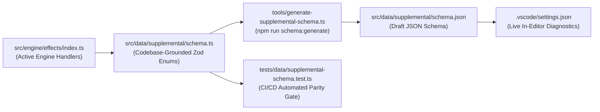

# Supplemental Schema Validation & VS Code Integration

## 🏛️ Overview

In **Marvel Champions Digital (MCD)**, all card-specific enrichment data resides exclusively in `src/data/supplemental/pack/*.json`. To preserve the **Declarative Data-First Invariant** and prevent speculative or unhandled mechanics from entering the game engine, supplemental card declarations are strictly validated against **codebase-grounded** schemas.

This architecture achieves two vital goals:
1. **Zero Drift / No Speculative Data:** Any ability step effect, trigger, timing, cost, target, or keyword declared in supplemental JSON must have an active handler in the engine (`src/engine/effects/index.ts`, `src/engine/pipeline/stat-calculator.ts`, `src/engine/pipeline/legality-checker.ts`). Unknown or unsupported variants are immediately rejected at build, test, and edit time.
2. **Real-Time VS Code Diagnostics & Autocomplete:** The Zod schema is exported to a standard Draft JSON Schema (`src/data/supplemental/schema.json`) mapped in `.vscode/settings.json`. Developers and agents get instant red squigglies on typos, property error tooltips, and `Ctrl+Space` autocomplete.

---

## 🔄 Architecture & Data Flow



---

## 🛠️ Regenerating the JSON Schema

Whenever a new effect primitive, trigger, timing, or cost parameter is implemented in the engine, update `src/data/supplemental/schema.ts` and regenerate the JSON Schema:

```bash
npm run schema:generate
```

This runs `tools/generate-supplemental-schema.ts` which uses Zod's native `toJSONSchema()` to compile `SupplementalPackSchema` into `src/data/supplemental/schema.json`.

---

## 💻 VS Code Configuration

Live JSON schema validation is configured in `.vscode/settings.json`:

```json
{
  "json.schemas": [
    {
      "fileMatch": ["/src/data/supplemental/pack/*.json"],
      "url": "./src/data/supplemental/schema.json"
    }
  ]
}
```

Additionally, each supplemental pack JSON file declares a relative schema reference:
```json
{
  "$schema": "../schema.json",
  "cards": { ... }
}
```

### In-Editor Features:
- **Red Squigglies:** Misspelled effect names or non-existent primitives (e.g. `"effect": "MAGIC_MISSILE"`) are highlighted immediately in red with an error tooltip listing allowed values.
- **Auto-Completion (`Ctrl+Space`):** Trigger autocomplete inside `effect: ""` to browse all 100+ active engine primitives.
- **Required Property Checks:** Omitting mandatory fields like `timing`, `steps`, or `id` raises missing-property diagnostics directly in the VS Code Problems pane.

---

## 🧪 CI/CD Parity & Quality Gates

The test suite [`tests/data/supplemental-schema.test.ts`](../../tests/data/supplemental-schema.test.ts) enforces four automated guarantees on every commit:
1. **Pack File Conformance:** 100% of card declarations across all supplemental packs validate against `SupplementalPackSchema` with zero errors.
2. **Duplicate Key Prevention:** Raw JSON files are scanned to ensure no duplicate card codes or JSON keys exist.
3. **Speculative Primitive Rejection:** Contract tests assert that `AbilityStepSchema` strictly rejects ungrounded effect names.
4. **Schema Freshness Check:** Asserts that `src/data/supplemental/schema.json` matches the runtime compilation of `SupplementalPackSchema`, preventing stale schema commits.

---

## 📚 Related Documentation & Specs
- [`docs/specifications/supplemental/01_metadata_and_audit.md`](../specifications/supplemental/01_metadata_and_audit.md): Metadata and audit schema specifications.
- [`docs/reports/supplemental_declarations_usage_report.md`](../reports/supplemental_declarations_usage_report.md): Declarative primitives audit report.
- [`AGENTS.md`](../../AGENTS.md): Authoritative agent protocols and data-first invariants.
