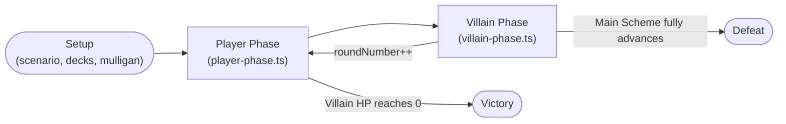
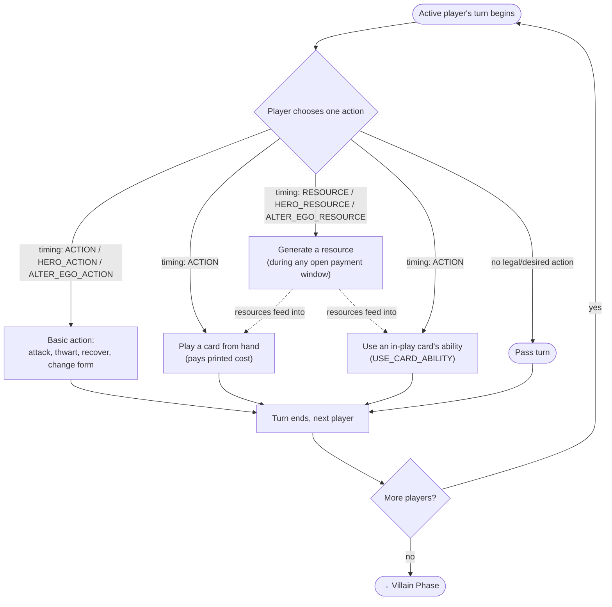
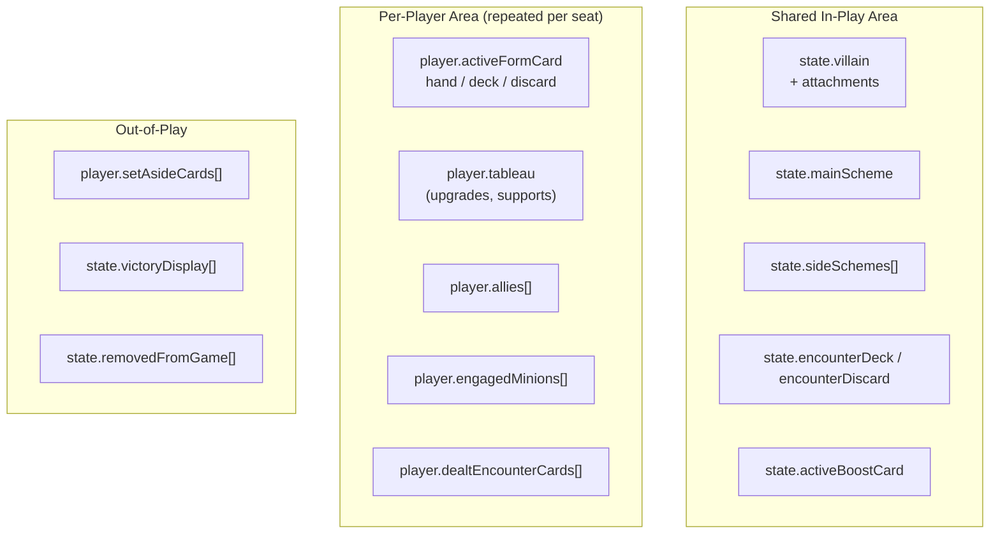

# 01. Engine & Round Overview

> Companion to [`algorithmic_rules_reference.md §2`](../algorithmic_rules_reference.md#2-core-game-loop--state-machine).
> This page re-frames the same state machine visually, oriented around "where does my card
> live, and when does its owner get to act?"

---

## 1. The Round Loop (Bird's-Eye View)

- **Player Phase:** every player takes turns until all have passed. This is where `ACTION`,
  `RESOURCE`, and both `HERO_*`/`ALTER_EGO_*` timings fire.
- **Villain Phase:** a fixed 6-step machine (see [04. Combat & Villain Phase](./04-combat-and-villain-phase.md))
  where `WHEN_REVEALED`, `BOOST`, and villain/minion activation triggers fire.
- Round-boundary triggers (`ROUND_BEGAN`, `ROUND_ENDED`, `PLAYER_PHASE_BEGAN/ENDED`,
  `VILLAIN_PHASE_BEGAN/ENDED`) are dispatched at the transitions above — see
  [`src/engine/pipeline/round-upkeep.ts`](../../src/engine/pipeline/round-upkeep.ts).

---

## 2. Player Turn — Where Each `timing` Fires

> [!TIP]
> `INTERRUPT` / `RESPONSE` / `FORCED_*` timings are **not** chosen from this menu — they are
> reactions dispatched by the [Trigger Resolution Stack](./03-trigger-resolution-stack.md) in
> response to _any_ player or villain-phase event, including the ones drawn above.

---

## 3. Zone Map (Where Targets & Effects Live)

Full field-level detail: [`algorithmic_rules_reference.md §3`](../algorithmic_rules_reference.md#3-formal-play-areas--zones-architecture-rr-v18-p-22-23).

---

**Next:** [02. Ability Lifecycle](./02-ability-lifecycle.md) — what happens the instant a
player or the engine decides to resolve one of your card's abilities.
