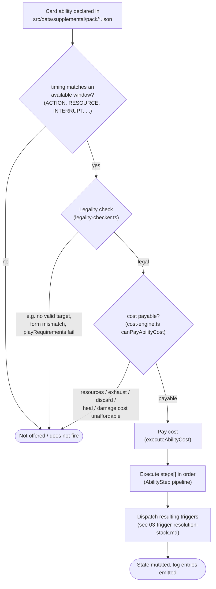
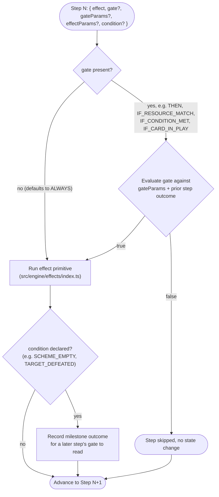
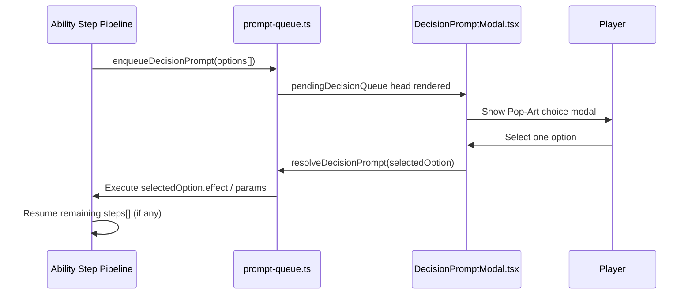

# 02. Ability Lifecycle

> Companion to [03. Costs & Targeting](../specifications/supplemental/03_costs_and_targeting.md)
> and [10. Sequences & Modals](../specifications/supplemental/10_sequences_and_prompts.md).
> This is the diagram to open whenever you're wondering _"in what order does my ability's
> JSON actually get evaluated?"_

---

## 1. From Card JSON to Applied Effect

---

## 2. Executing One `steps[]` Array

Each entry in `steps: []` is evaluated independently, in array order, and may reference the
outcome of a previous step via `condition` / `gate` / `target: "PREVIOUS_TARGET"`.

> [!NOTE]
> `gateParams` configures the _gate_ (whether the step runs); `effectParams` configures the
> _effect_ (what the step does) — they are never merged. See
> [ADR-0060](../decisions/0060-gate-and-effect-params-separation.md), or
> [10. Sequences & Modals §1](../specifications/supplemental/10_sequences_and_prompts.md#1-unified-action-step-sequencing-steps--conditional-gates).

---

## 3. Interactive Steps: `PLAYER_CHOICE`

When a step's `effect` is `PLAYER_CHOICE`, the pipeline above pauses instead of running
straight through:

---

**Previous:** [01. Engine & Round Overview](./01-engine-overview.md)
**Next:** [03. Trigger Resolution Stack](./03-trigger-resolution-stack.md) — how the engine
orders reactions when several cards want to respond to the same event.
