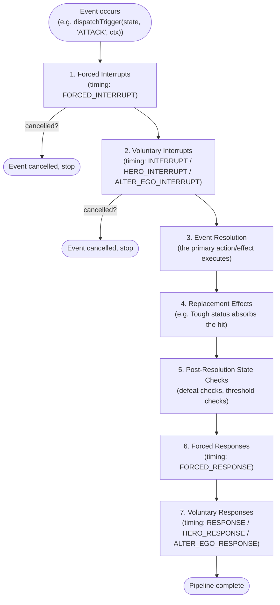
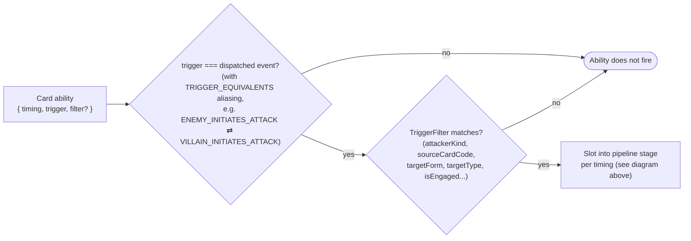
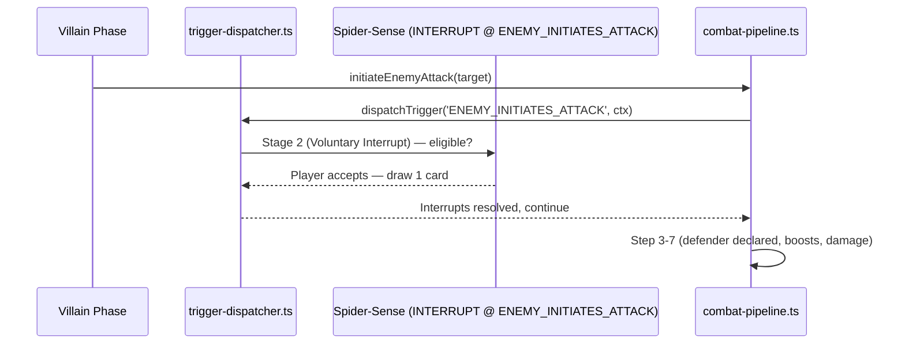

# 03. Trigger Resolution Stack

> Companion to [02. Timings & Triggers](../specifications/supplemental/02_timings_and_triggers.md)
> and [`algorithmic_rules_reference.md §4`](../algorithmic_rules_reference.md#4-the-7-stage-timing-pipeline--nested-resolution-stack).
> Read this whenever two or more cards could react to the same in-game event.

---

## 1. The 7-Stage Nested Resolution Stack

Every dispatched event (an attack, damage, a card entering play, threat placement, etc.)
passes through this fixed pipeline, implemented conceptually in
[`src/engine/triggers/trigger-dispatcher.ts`](../../src/engine/triggers/trigger-dispatcher.ts):

> [!IMPORTANT]
> **Simultaneous ordering:** if multiple abilities are eligible at the _same_ stage, the
> active/first player chooses resolution order (RR v1.8 p. 16). The engine does not guess —
> it prompts.

---

## 2. Matching a Card's `trigger` to a Dispatch Point

A card's `trigger` field (e.g. `'ATTACK'`, `'DAMAGE_WOULD_BE_TAKEN'`, `'CARD_PLAYED'`) selects
_which_ event this ability listens for; its `timing` (`INTERRUPT` vs `RESPONSE` vs
`FORCED_*`) selects _which stage above_ it resolves at.

- Full `trigger` catalog and source pipeline mapping:
  [02. Timings & Triggers §2](../specifications/supplemental/02_timings_and_triggers.md#2-event-trigger-windows-trigger).
- Alias table (`TRIGGER_EQUIVALENTS`) lives in
  [`trigger-dispatcher.ts`](../../src/engine/triggers/trigger-dispatcher.ts) — e.g. a card
  written against `CHARACTER_DEFEATED` also fires for `MINION_DEFEATED` and `HOST_DEFEATED`.

---

## 3. Worked Example: Spider-Sense vs. an Incoming Attack

---

**Previous:** [02. Ability Lifecycle](./02-ability-lifecycle.md)
**Next:** [04. Combat & Villain Phase Sequences](./04-combat-and-villain-phase.md) — the
concrete step-by-step order of an attack and of the Villain Phase.
