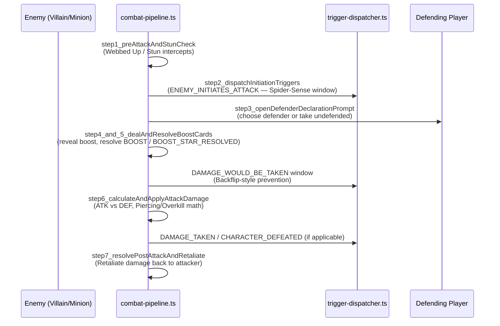
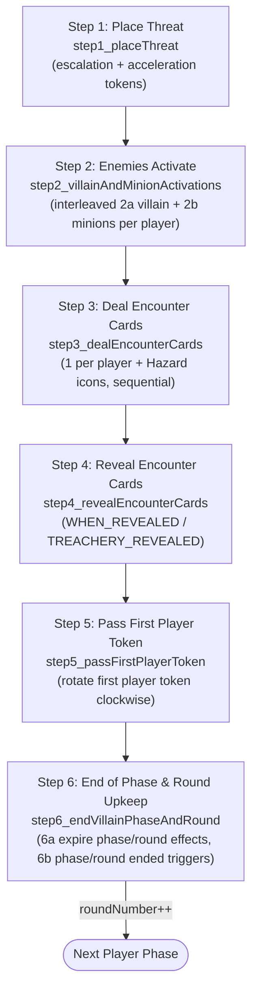
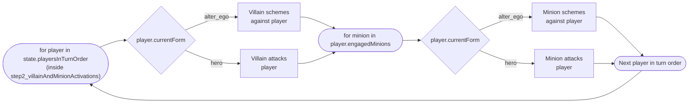

# 04. Combat & Villain Phase Sequences

> Companion to [05. Combat & Threat](../specifications/supplemental/05_effects_combat_threat.md)
> and [08. Villain & Nemesis](../specifications/supplemental/08_effects_villain_nemesis.md).
> Ground truth: [`src/engine/pipeline/combat-pipeline.ts`](../../src/engine/pipeline/combat-pipeline.ts)
> and [`src/engine/pipeline/villain-phase.ts`](../../src/engine/pipeline/villain-phase.ts).

---

## 1. Attack Resolution — `combat-pipeline.ts` Steps 1–7



| Step | Function                               | Card-author-relevant trigger(s)                  |
| :--- | :------------------------------------- | :----------------------------------------------- |
| 1    | `step1_preAttackAndStunCheck`          | `ATTACHED_ENEMY_ATTACKS` (e.g. Webbed Up)        |
| 2    | `step2_dispatchInitiationTriggers`     | `ENEMY_INITIATES_ATTACK`                         |
| 3    | `step3_openDefenderDeclarationPrompt`  | `ATTACK_DEFENDED`                                |
| 4–5  | `step4_and_5_dealAndResolveBoostCards` | `BOOST`, `BOOST_STAR_RESOLVED`                   |
| —    | _(intercept window between 5 and 6)_   | `DAMAGE_WOULD_BE_TAKEN`                          |
| 6    | `step6_calculateAndApplyAttackDamage`  | `DAMAGE_TAKEN`, `CHARACTER_DEFEATED`, `DEFEATED` |
| 7    | `step7_resolvePostAttackAndRetaliate`  | `ATTACK_RESOLVED`                                |

---

## 2. The 6-Step Villain Phase



> [!NOTE]
> RR v1.8 p. 47 describes Step 2 as "Enemies Activate" containing an interleaved player-by-player loop
> (2a the villain activates against a player, then 2b each minion engaged with that player activates against them),
> implemented by `step2_villainAndMinionActivations` (aliased as `step2_villainActivations` for backward compatibility).
> Encounter cards are dealt in **Step 3** (`step3_dealEncounterCards`, aliased as `step4_dealEncounterCards`) and
> revealed in **Step 4** (`step4_revealEncounterCards`, aliased as `step5_revealEncounterCards`).
> In **Step 5**, the first player token passes clockwise (`step5_passFirstPlayerToken`).
> In **Step 6** (`step6_endVillainPhaseAndRound`, composite wrapper `step6_passFirstPlayerAndRoundUpkeep`):
> - **Step 6a:** Effects lasting until the end of the phase/round expire, and once-per-phase/round limits reset.
> - **Step 6b:** Triggers for `VILLAIN_PHASE_ENDED` and `ROUND_ENDED` resolve in turn order starting with the newly designated first player, followed by round transition to the next Player Phase.
>
> Runtime orchestrator in `continueVillainPhase` (`villain-phase.ts`):
>
> ```ts
> // Step 2: Activations
> if (state.villainPhaseStep === VillainPhaseStep.VILLAIN_ACTIVATIONS) {
>   state = step2_villainAndMinionActivations(state, options);
>   ...
>   state.villainPhaseStep = VillainPhaseStep.DEAL_ENCOUNTER_CARDS;
> }
> // Step 3: Deal Encounter Cards
> if (state.villainPhaseStep === VillainPhaseStep.DEAL_ENCOUNTER_CARDS) {
>   state = step3_dealEncounterCards(state);
>   ...
>   state.villainPhaseStep = VillainPhaseStep.REVEAL_ENCOUNTER_CARDS;
> }
> // Step 4: Reveal Encounter Cards
> if (state.villainPhaseStep === VillainPhaseStep.REVEAL_ENCOUNTER_CARDS) {
>   state = step4_revealEncounterCards(state);
>   ...
> }
> // Step 5 & 6: Pass First Player & Round Upkeep
> state = step5_passFirstPlayerToken(state);
> return step6_endVillainPhaseAndRound(state);
> ```

### Step 2 detail — per-player interleaving



> [!NOTE]
> A `WHEN_REVEALED` ability on an encounter card you're authoring always resolves inside
> **Step 4**, and never earlier — treachery text that reads "when revealed" should never be
> modeled as a `RESPONSE`/`INTERRUPT`.

---

**Previous:** [03. Trigger Resolution Stack](./03-trigger-resolution-stack.md)
**Next:** [05. Card Authoring Decision Guide](./05-card-authoring-decision-guide.md) — pick the
right `timing`/`trigger`/`effect` combination for a new card from scratch.
