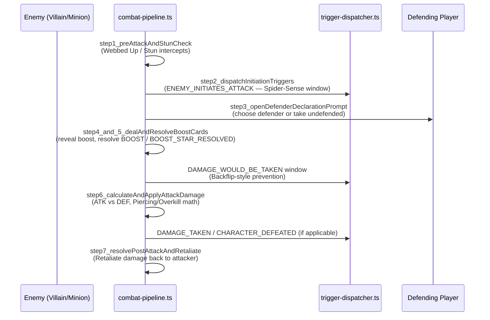
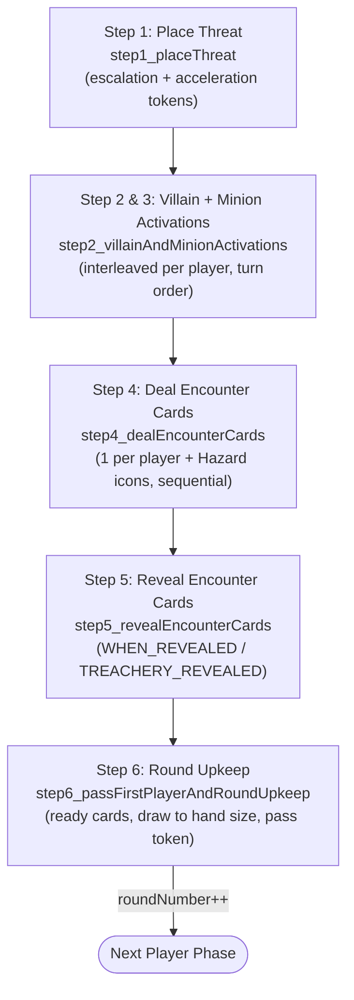

# 04. Combat & Villain Phase Sequences

> Companion to [05. Combat & Threat](../specifications/supplemental/05_effects_combat_threat.md)
> and [08. Villain & Nemesis](../specifications/supplemental/08_effects_villain_nemesis.md).
> Ground truth: [`src/engine/pipeline/combat-pipeline.ts`](../../src/engine/pipeline/combat-pipeline.ts)
> and [`src/engine/pipeline/villain-phase.ts`](../../src/engine/pipeline/villain-phase.ts).

---

## 1. Attack Resolution — `combat-pipeline.ts` Steps 1–7



| Step | Function                               | Card-author-relevant trigger(s)                  |
| :--- | :------------------------------------- | :----------------------------------------------- |
| 1    | `step1_preAttackAndStunCheck`          | `ATTACHED_ENEMY_ATTACKS` (e.g. Webbed Up)        |
| 2    | `step2_dispatchInitiationTriggers`     | `ENEMY_INITIATES_ATTACK`                         |
| 3    | `step3_openDefenderDeclarationPrompt`  | `ATTACK_DEFENDED`                                |
| 4–5  | `step4_and_5_dealAndResolveBoostCards` | `BOOST`, `BOOST_STAR_RESOLVED`                   |
| —    | _(intercept window between 5 and 6)_   | `DAMAGE_WOULD_BE_TAKEN`                          |
| 6    | `step6_calculateAndApplyAttackDamage`  | `DAMAGE_TAKEN`, `CHARACTER_DEFEATED`, `DEFEATED` |
| 7    | `step7_resolvePostAttackAndRetaliate`  | `ATTACK_RESOLVED`                                |

---

## 2. The 6-Step Villain Phase



> [!NOTE]
> RR v1.8 p. 22 describes Steps 2 and 3 as a single interleaved player-by-player loop
> (villain activates against a player, then each minion engaged with that player activates),
> so the engine implements both as **one** function, `step2_villainAndMinionActivations`
> (aliased as `step2_villainActivations` for backward compatibility). A standalone
> `step3_minionActivations` helper and the `MINION_ACTIVATIONS` enum member previously
> existed as an unreachable legacy path (the real runtime orchestrator never called them —
> see proof below) and have since been **removed**; the corresponding standalone test block
> was deleted since the same minion attack/scheme behavior is already covered by the
> interleaved-order assertions in `step2_villainActivations`'s test suite.
>
> Proof (retained for historical context): the real runtime orchestrator,
> `continueVillainPhase` in `villain-phase.ts`, calls `step2_villainAndMinionActivations`
> then jumps straight to `step4_dealEncounterCards`:
>
> ```ts
> // Step 2: Activations
> if (state.villainPhaseStep === VillainPhaseStep.VILLAIN_ACTIVATIONS) {
>   state = step2_villainAndMinionActivations(state, options);
>   ...
>   state.villainPhaseStep = VillainPhaseStep.DEAL_ENCOUNTER_CARDS;
> }
> // Step 4: Deal Encounter Cards
> if (state.villainPhaseStep === VillainPhaseStep.DEAL_ENCOUNTER_CARDS) {
>   state = step4_dealEncounterCards(state);
>   ...
> ```

### Step 2/3 detail — per-player interleaving


> [!NOTE]
> A `WHEN_REVEALED` ability on an encounter card you're authoring always resolves inside
> **Step 5**, and never earlier — treachery text that reads "when revealed" should never be
> modeled as a `RESPONSE`/`INTERRUPT`.

---

**Previous:** [03. Trigger Resolution Stack](./03-trigger-resolution-stack.md)
**Next:** [05. Card Authoring Decision Guide](./05-card-authoring-decision-guide.md) — pick the
right `timing`/`trigger`/`effect` combination for a new card from scratch.
