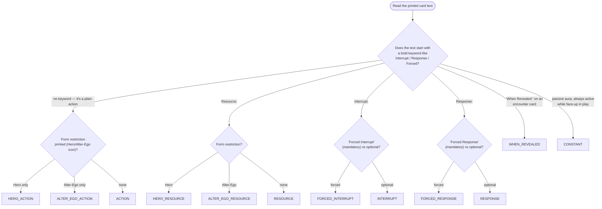
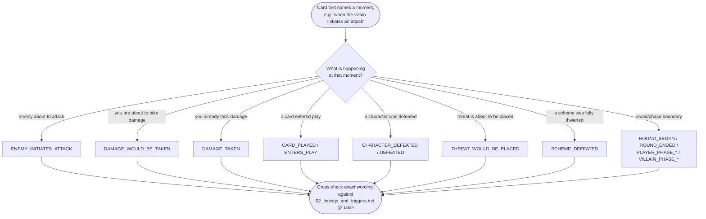
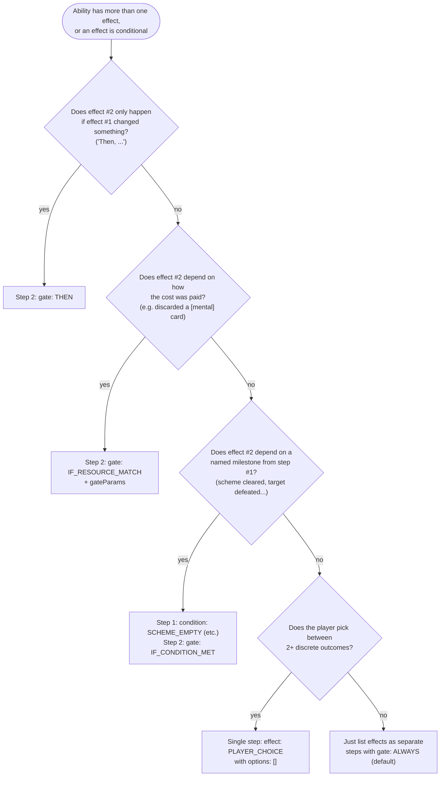

# 05. Card Authoring Decision Guide

> This is the one page in the atlas with no direct 1:1 spec equivalent — it's a practical
> decision tree for turning printed card text into a first-draft supplemental JSON entry.
> Always finish by checking your draft against the linked spec module before submitting.

---

## 1. "What `timing` do I use?"

Full enum reference: [02. Timings & Triggers §1](../specifications/supplemental/02_timings_and_triggers.md#1-ability-timing-types-timing).

---

## 2. "What `trigger` does my Interrupt/Response bind to?"

If your event isn't listed, check `TRIGGER_EQUIVALENTS` in
[`trigger-dispatcher.ts`](../../src/engine/triggers/trigger-dispatcher.ts) for an existing alias
before proposing a new trigger literal (new literals require an engine change, not just
supplemental data — see [feature-delivery skill](../../.agents/skills/feature-delivery/SKILL.md)).

---

## 3. "Do I need `steps: []`, `gate`, or `condition`?"

Full gate/condition catalog:
[10. Sequences & Modals §1](../specifications/supplemental/10_sequences_and_prompts.md#1-unified-action-step-sequencing-steps--conditional-gates).

---

## 4. Draft-to-Submission Checklist

1. Pick `timing` → §1 above.
2. Pick `trigger` (if reactive) → §2 above.
3. Pick effect primitive(s) from
   [05](../specifications/supplemental/05_effects_combat_threat.md)–[08](../specifications/supplemental/08_effects_villain_nemesis.md)
   by category (combat, zones, status/economy, villain/nemesis).
4. Sequence multi-effect abilities with `steps: []`, `gate`/`condition` → §3 above.
5. Add `cost` ([03. Costs & Targeting](../specifications/supplemental/03_costs_and_targeting.md))
   and `playRequirements` ([11. Play Requirements](../specifications/supplemental/11_play_requirements.md))
   if the card restricts who/when it can be used.
6. Validate against [`tests/data/supplemental-schema.test.ts`](../../tests/data/supplemental-schema.test.ts)
   and follow the [Card Integration Protocol](../../.agents/skills/card-integration-protocol/SKILL.md)
   for ambiguity handling.

---

**Previous:** [04. Combat & Villain Phase Sequences](./04-combat-and-villain-phase.md)
**Back to index:** [Visual Guides README](./README.md)
